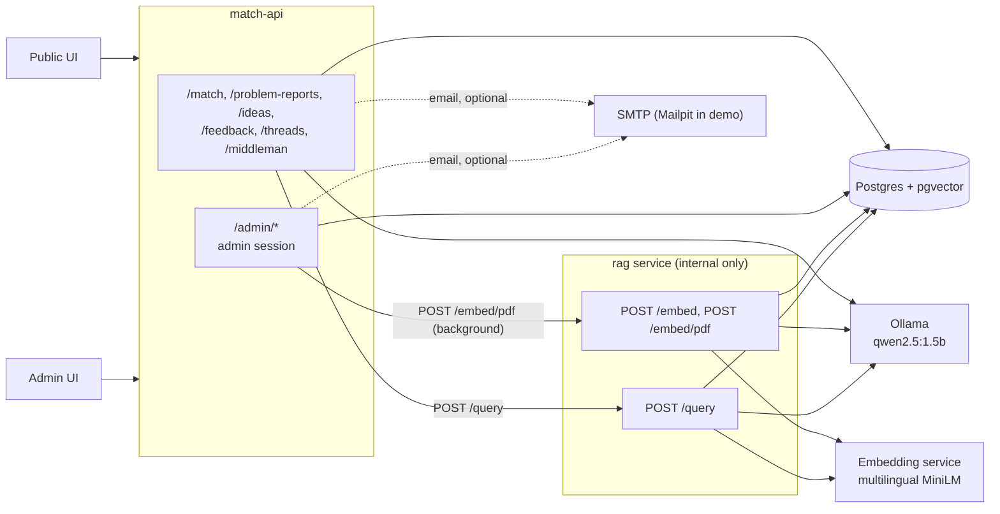
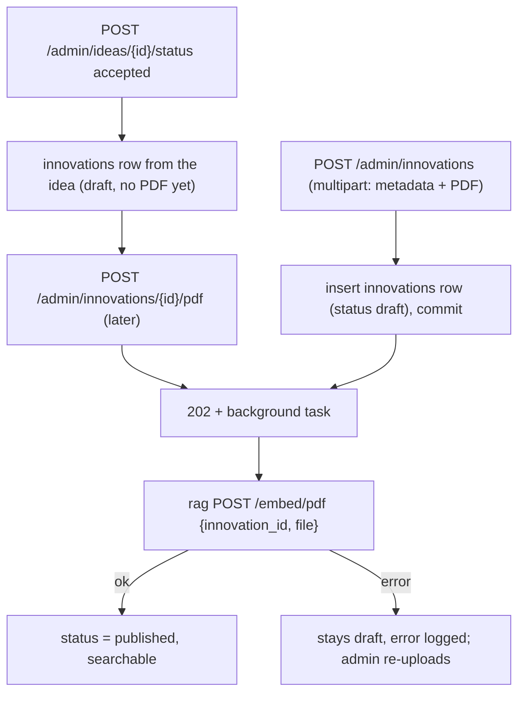
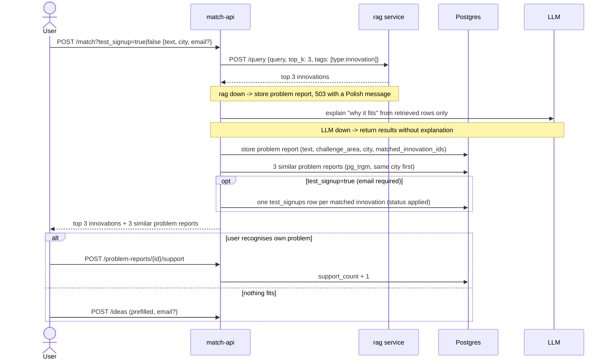
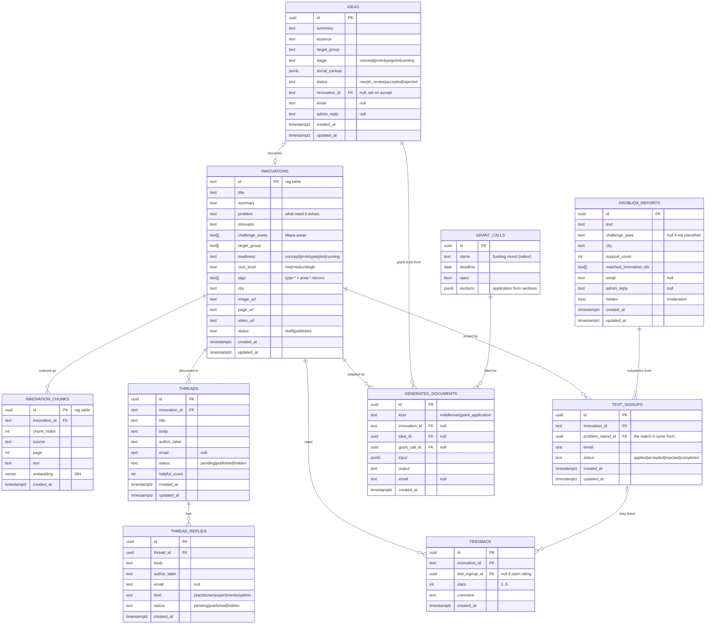

# Backend architecture: rag service + match-api

## Context

ROPS has ~200 social innovations that nobody can find. Matchmaking (problem text -> innovations) is the mandatory 10% of the score. Two small FastAPI services share one Postgres:
- the rag service (`rag/`): chunking, external embedding-service integration and retrieval. It is finished and is used as merged.
- match-api (`backend/`): the public API and the admin panel.

Inputs: `documentation/knowledge-base/CRITERIA-Wojewodztwo-Malopolskie-HUBMI.md`, `documentation/sample-data/` (8 innovations, 8 test queries), the shared team Notion page (`HackYeah`).

Principle: hackathon scope. Build the smallest thing that covers every requirement ([requirements-traceability.md](requirements-traceability.md)), with as few tables as possible. Anything that can be a SQL query on read is not a job. Deferred ideas are listed in section 8.

## 1. Components



| | rag service (`rag/`) | match-api (`backend/`) |
|---|---|---|
| Purpose | chunk one innovation and request external embeddings (`POST /embed`, `POST /embed/pdf`); retrieval (`POST /query`) | `/match` (calls rag, LLM explanation, optional test signup), problem reports, ideas, threads, Middleman / grant drafts, admin (incl. PDF upload that triggers embedding) |
| Exposure | internal compose network only (no auth) | public + `/admin/*` |
| Writes | `innovation_chunks` | `innovations` rows (admin CRUD), `problem_reports`, `ideas`, `grant_calls`, `test_signups`, `feedback`, `threads`, `thread_replies`, `generated_documents` |
| Down means | `/match` returns 503 (problem report still stored); uploaded innovations stay draft until re-uploaded | site down |

How rag behaves, and what match-api does about it:
- **`POST /query {query, top_k ≤ 3, city?, title?}`:**
  - returns the best chunk per innovation, `status = 'published'` only
    - ranks results with equal weights: 50% vector similarity and 50% basic title match; `city` remains an optional filter
- **Temporary `GET /query/test/{innovation_id}`:** reads one stored innovation, its tags, status, text, and chunk count for verifying test embeddings.
- **`POST /embed {innovation_id}`:**
  - needs an existing `innovations` row and replaces all of its chunks
  - match-api inserts and commits the row first, then calls it
- **Temporary `POST /embed/test {text}`:** creates a published `test-<uuid>` innovation, stores the plain text and its chunks, and returns the generated innovation ID; this is for model checks only.
- Embeddings are generated by the separate `embeddings` container using `sentence-transformers/paraphrase-multilingual-MiniLM-L12-v2`; the rag container does not load the model itself.
- Tag generation and grounded answer generation use the separate `ollama` container with `qwen2.5:1.5b`; the `ollama-init` container downloads the model into the persistent `ollama_models` volume.
- **`innovations.city` is nullable but returned as `str`:** match-api always writes `city` (`''` when unknown).

match-api calls rag directly over HTTP (`RAG_URL`); there is no queue between them. The `rabbitmq` service in compose is not used by match-api.

## 2. Flow: adding innovations

An innovation is visible to users only once rag has chunks for it, and a PDF from the admin is always the source.



- **Create from a PDF:** `POST /admin/innovations` takes the metadata (`title`, `summary`, `problem`, `innovator`, `challenge_areas`, `readiness`, `cost_level`, `target_group`, `tags`, `city`, `page_url`, `image_url`, `video_url`) plus the PDF.
  - match-api validates it (PDF, ≤ 10 MB, the same limits as rag), saves the file under `UPLOAD_DIR`, inserts the row as `draft`, commits, and returns 202 with the id.
  - A FastAPI background task then sends the PDF to rag `POST /embed/pdf`; on success match-api sets `status = 'published'`. The draft is committed first because rag looks the row up and replaces its chunks.
  - Trade-off: a background task instead of a queue. Simple and enough for a handful of uploads, but a process restart mid-embed loses the task (the row stays draft; the admin uploads again), and nothing retries.
  - Tags get `type:innovation` and one `area:<slug>` per challenge area, since rag filters only on tags.
- **Idea → innovation:** accepting an idea creates a `draft` innovations row from the idea card and stores it in `ideas.innovation_id`. It stays invisible until the admin uploads its PDF with `POST /admin/innovations/{id}/pdf`, which runs the same background embed.
- **Re-upload** replaces all chunks; editing metadata (`PATCH`) does not re-embed.
- **No job table:** the admin list shows `indexed` (has chunks, `EXISTS` on `innovation_chunks`) next to `status`. A failed embed leaves the row as an unindexed draft.
- **No seed data:** innovations enter only through the admin upload, so the demo data is uploaded like real content.

## 3. Flow: matchmaking and problem reports



Testing is part of matching, not a separate endpoint. With `?test_signup=true` the user volunteers to test the innovations matched for their problem: one `test_signups` row per returned innovation, linked to the problem report so the admin sees why. Without an email the request returns 422.

Ranking comes from rag; the LLM only explains and may cite only retrieved rows. User text is data, never instructions. The challenge area (one of the 8 Mapa areas) comes from a small LLM classification call, falling back to none.

## 4. Auth, contact and notifications

- **No public accounts.** An in-process per-IP rate limit guards public writes and `/match`; nothing about the IP is stored.
- **Optional email:** a problem report or idea may carry an `email` (with consent); `POST /match?test_signup=true` requires one. It is stored on the item itself. There is no contact table and there are no profile pages.
- **Admin replies** are an `admin_reply` column on the problem report or idea.
  - The admin sets it; if the item has an email, a notification email is sent.
  - A problem report reply is also shown on its public page, so it covers everyone who pressed "mnie też".
- **Notifier:** SMTP from env, a no-op if unset, Mailpit in compose for the demo (synthetic addresses only). It runs as a FastAPI background task after commit, at-most-once: a failure is logged, not retried. The inbox stays the source of truth.

| Event | Recipient |
|---|---|
| new idea, new problem report, new pending thread | admin (`ADMIN_NOTIFY_EMAIL`) |
| `admin_reply` set, idea status changed | the item's `email` |
| test signup accepted / rejected / completed | the signup's `email` |
| thread / reply published | the author's `email` (if set) |

- **Admin side:** one shared admin login from env (`ADMIN_USERNAME`, `ADMIN_PASSWORD`; compose defaults to `admin` / `1234` for the demo), server-side sessions in memory, `HttpOnly; Secure; SameSite=Strict` cookie; see [.claude/designs/admin-auth.md](../../.claude/designs/admin-auth.md).
  - `require_admin` guards `/admin/*`.
  - `POST /admin/auth/login {username, password}`, `POST /admin/auth/logout`, `GET /admin/auth/me`.
  - Sessions: 8 h absolute, 30 min idle; login limited to 5 failures per username per 15 min; a foreign `Origin` on unsafe methods gets 403.

## 5. Admin endpoints (all under `/admin`, behind the admin session except login and logout)

| Feature | Endpoints |
|---|---|
| Auth | `POST /admin/auth/login` (public), `POST /admin/auth/logout`, `GET /admin/auth/me` |
| Innovations | `GET /admin/innovations` (filters `status`, `indexed`, `q`, `limit`, `offset`), `POST /admin/innovations` (multipart metadata + PDF, 202, §2), `GET /admin/innovations/{id}`, `PATCH /admin/innovations/{id}` (metadata only), `POST .../{id}/pdf` (upload or replace the PDF, 202), `POST .../{id}/publish`, `POST .../{id}/unpublish`, `GET .../{id}/feedback` (rating avg/count, signups), `GET .../{id}/stats` (matches total / 7d / by week, area and city, people reached, testers, rating distribution, matched problems) |
| Inbox | `GET /admin/inbox?since=`: new ideas, new problem reports, critical problem reports, new test signups, pending threads / replies |
| Ideas | `GET /admin/ideas` (filter `status`), `GET /admin/ideas/{id}`, `POST .../{id}/reply`, `POST .../{id}/status` (`accepted` creates a draft innovation, §2) |
| Problem reports | `GET /admin/problem-reports` (filters `challenge_area`, `city`), `GET /admin/problem-reports/{id}`, `POST .../{id}/reply`, `POST .../{id}/hide` |
| Threads | `GET /admin/threads` (filter `status`, `innovation_id`), `POST .../{id}/status` (`published`\|`hidden`), `POST .../replies/{id}/status` |
| Testing | `GET /admin/test-signups` (filter `innovation_id`, `status`), `POST /admin/test-signups/{id}/status` (`accepted`\|`rejected`\|`completed`) |
| Grant calls | `GET /admin/grant-calls`, `POST /admin/grant-calls`, `PATCH /admin/grant-calls/{id}` (open/close, form sections) |
| Generated docs | `GET /admin/generated-documents` (filter `kind`, `innovation_id`, `idea_id`) |
| Reports | `GET /admin/reports/trends`, `/critical`, `/locations`, `/gaps`, `/innovations` (one stats row per innovation), each with `?format=json\|csv` |

### Reports are queries, not jobs

| Report | Query |
|---|---|
| trends | problem reports (+ `support_count`) by challenge area / city / week |
| critical | score = problem reports x distinct cities x growth ratio (last 7d vs previous 7d), computed on read |
| locations | per-city counts by challenge area |
| gaps | problem reports with no matched innovation (empty `matched_innovation_ids`) |
| innovations | per innovation: problem reports whose `matched_innovation_ids` contain it (total, 7d, previous 7d, distinct cities, + `support_count` = people reached), test signups by status, rating avg / count |

CSV export is a streaming response. Cities with fewer than 5 problem reports are shown as "too few to display".

### Public endpoints (no auth; per-IP rate limit on writes)

| Feature | Endpoints |
|---|---|
| Matching | `POST /match?test_signup=` `{text, city, email?, consent}` → `{problem_report_id, innovations, similar_reports, test_signup_ids}`; `test_signup=true` needs an email (422 otherwise) |
| Problem reports | `GET /problem-reports/{id}` (public page with `admin_reply`), `POST /problem-reports/{id}/support` ("mnie też") |
| Ideas | `POST /ideas` `{summary, essence, target_group, stage, social_canvas?, email?, consent}`, `POST /ideas/{id}/grant-application {grant_call_id}` (open calls only, stored in `generated_documents`) |
| Library | `GET /innovations` (published only; filters `challenge_area`, `q`, `limit`, `offset`), `GET /innovations/{id}` (with `rating_avg`, `rating_count`), `POST /innovations/{id}/feedback {stars, comment, test_signup_id?}` |
| Threads | `GET /innovations/{id}/threads` (published threads + published replies), `POST /innovations/{id}/threads` (202, `pending`), `POST /threads/{id}/replies` (202, `pending`) |
| Middleman | `POST /middleman {innovation_id, institution_type, needs, email?, consent}` (the response is the stored document) |
| Grant calls | `GET /grant-calls` (open only) |

Admin and public services are db-backed (`backend/app/services/{admin,public}/db.py`, one session per request via `get_db`); the mocks in `mock.py` stay for unit tests through dependency overrides.
- Retrieval and LLM output are still stand-ins (`backend/app/services/public/drafts.py`): word overlap instead of rag `/query`, templates instead of LLM explanations, Middleman cards and grant drafts. The rag client and LLM prompts are the next step.
- The admin problem report response keeps `location`, `is_critical` and `criticality_score` for the admin frontend: `location` is filled from `city`, criticality is computed on read (score ≥ 10 is critical).

## 6. Data model

Two rag tables (used as merged), plus flat match-api tables. match-api also extends `innovations` with extra columns that rag ignores at query time (rag still filters on `tags`, `city`, `status`).



- **Innovations** keep the rag columns and add match-api fields used by the library card, Middleman and LLM explanations: `problem`, `innovator`, `challenge_areas`, `target_group`, `readiness`, `cost_level`, `video_url`. Films still link through `page_url` / `video_url`. Dropped: unused `parent_url` (rag aliases `page_url` as `parent_url` in responses only).
- **Tags:** every row carries `type:innovation` or `type:report` (ROPS reports and Mapa Wyzwań PDFs), so reports never show up in `/match`. Challenge areas are also mirrored as `area:*` tags for rag filters; canonical values live in `challenge_areas`.
- **Taxonomy:** the 8 Mapa challenge areas (Rodzina i piecza zastepcza, Bezdomnosc, Niepelnosprawnosc, Ubostwo, Integracja cudzoziemcow, Zdrowie, Zdrowie psychiczne, Seniorzy).
- **city** = gmina, picked from a fixed list. Free-text city spellings are rejected on write.
- **Criticality** is not stored: reports compute it on read (problem reports × distinct cities × 7d growth).
- **Threads** are per-innovation community discussions (R5). No public accounts: `author_label` + optional `email`. Flat replies only (no nested reply trees). `helpful_count` stays in the table, but the public "pomocne" endpoint is deferred, so nothing increments it yet. Public replies are always `practitioner`; `expert` / `mentor` / `admin` are set by ROPS. Public lists show `published` only; `pending` waits for ROPS moderation.
- **Generated documents** store Middleman service cards and grant-application drafts so the user and admin can reopen them. They are not re-submitted into an external grant DB (that stays deferred).
- **Naming:** always `city` (not `location`), always `stars` on feedback.

Public endpoints that write the new tables: `POST /innovations/{id}/threads`, `POST /threads/{id}/replies`, `POST /middleman`, grant generator on an idea (both persist a `generated_documents` row).

## 7. Failure modes

| Failure | Handling |
|---|---|
| rag service down | `/match` returns 503 with a plain-language Polish message; the problem report is still stored |
| background `/embed/pdf` fails (rag down, bad PDF) | the row stays an unindexed draft, the error is logged; the admin re-uploads the PDF |
| process restarts during a background embed | same as a failure: the row stays draft, the admin re-uploads (no job table) |
| LLM down | results without explanation or challenge area |
| spam on public routes | per-IP rate limit, input length caps |
| prompt injection | user text treated as data, explanations limited to retrieved rows |
| SMTP unset or down | email skipped; the admin still sees the inbox, the reply is on the public page |
| "mnie też" or ratings sent many times | inflated `support_count` (feeds criticality) and `rating_avg`; the per-IP rate limit on public writes is a blocker before a live launch |
| spam threads or replies | per-IP rate limit; default `pending` until admin publishes |
| Postgres down | everything down; accepted for MVP |

## 8. Deferred (add only when needed)

| Idea | Add when |
|---|---|
| contacts table, profile pages, nested reply trees | flat threads + one `admin_reply` column are not enough |
| outbox, worker, webhooks to the grant DB | real integration is needed |
| admin accounts and sessions in Postgres | more than one match-api replica |
| test rounds, verified tester reports | ROPS runs real testing rounds |
| submitting grant applications into an external system | applications leave the platform |
| report snapshots / materialized views | report queries get slow |
| per-user likes (instead of counters) | anonymous inflation becomes a real problem |

## 9. Layout and build order

```
backend/             # match-api
  app/               # api/*.py, api/admin/*.py, schemas/, services/ (interface + mock first, db next), rag client
  sql/               # match-api tables + innovations ALTER, mounted into initdb after rag's
rag/                 # used as merged
docker-compose.yml   # postgres (pgvector image), rag, embeddings, ollama, api, mailpit
```

1. Backend schema file + compose (one `DATABASE_URL`, `RAG_URL`, mailpit): match-api tables + `innovations` column extensions.
2. Admin innovations on rag's table: PDF upload + background `/embed/pdf` + auto-publish; idea accept creates a draft innovation
3. `/match` calling rag, LLM explanation; the 8 sample queries pass.
4. Problem reports, support, similar reports; admin problem reports + reply + hide.
5. Ideas + admin ideas, inbox, notifier.
6. Threads + replies (public write, admin moderate); wire innovation detail page off the API.
7. Reports (SQL) + CSV.
8. `test_signup` on `/match`, feedback (optional `test_signup_id`), grant calls + generator, Middleman — both LLM outputs stored in `generated_documents`.

## 10. Verification

- Unit: rag client errors -> 503, `require_admin` (admin / none), rate limit (429 over the limit).
- Regression: the 8 queries in `sample-matchmaking-queries.md` return the expected id in the top 3.
- Integration:
  - `docker compose up`, upload innovations through the admin, curl `/match`
  - draft innovations and `type:report` rows are never returned
  - with rag stopped, `/match` returns 503 and the problem report is stored
  - every `/admin/*` route returns 401 without a session (parametrised test)
  - pending threads stay invisible on the public innovation page until published

## 11. Open questions

1. Can we scrape the Biblioteka Innowacji, or do we stay on sample data plus hand-curated entries?
2. The ROPS PDFs (Mapa Wyzwan, Canvas, reports) need downloading by hand into the repo.
3. Things for the rag owner (rag stays as merged):
   - `all-MiniLM-L6-v2` is English-only and the content is Polish (a 384-dim multilingual MiniLM is a drop-in without changing `vector(384)`)
   - the title/tag boost only fires when the whole query is a substring
   - a null `city` makes `/query` fail with 500 — match-api always writes `city` (`''` when unknown)

## Changes

1. Admin auth: server-side session cookie instead of a shared JWT; for the hackathon one shared login from env (`ADMIN_USERNAME` / `ADMIN_PASSWORD`).
2. IP logic removed; an optional email is stored on the item for notifications.
3. The rag service owns chunking, embedding and retrieval; `/match` calls it over HTTP, rag down gives 503 with the problem report kept.
4. Data model: merged rag tables + match-api tables (`problem_reports`, `ideas`, `grant_calls`, `test_signups`, `feedback`, `threads`, `thread_replies`, `generated_documents`):
   - the email and `admin_reply` live on the item; problem reports also have `hidden`
   - "mnie też" is a counter; thread "pomocne" is deferred
   - innovations keep rag columns and add `problem`, `innovator`, `challenge_areas`, `target_group`, `readiness`, `cost_level`, `video_url`; challenge areas are mirrored into `area:*` tags for rag
   - `location` is renamed to `city`; cities come from a fixed list
   - criticality is computed on read, not stored
   - Middleman and grant drafts are stored in `generated_documents`
   - community threads are first-class (pending moderation, flat replies, role `kind`)
   - contacts, nested reply trees, test rounds, per-item tokens and index jobs stay deferred
5. Innovation upload calls rag `POST /embed/pdf` directly from a background task and publishes the innovation on success; no queue between match-api and rag.
