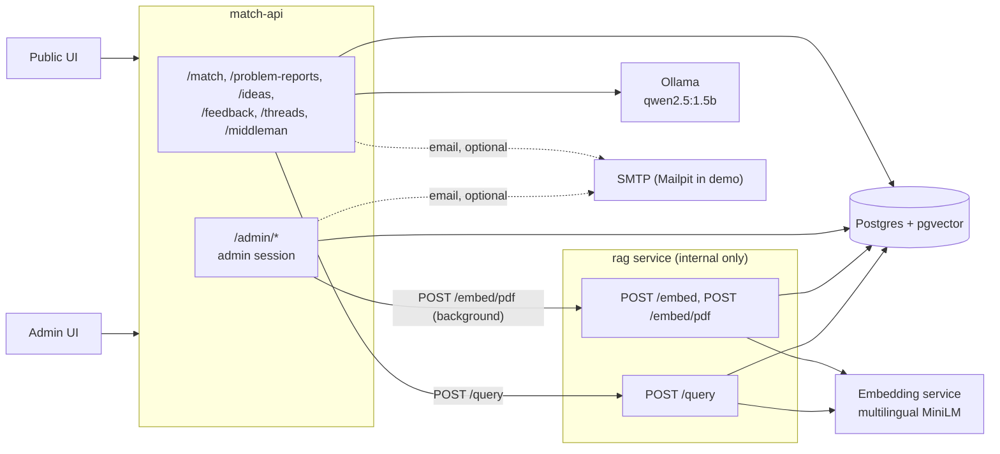
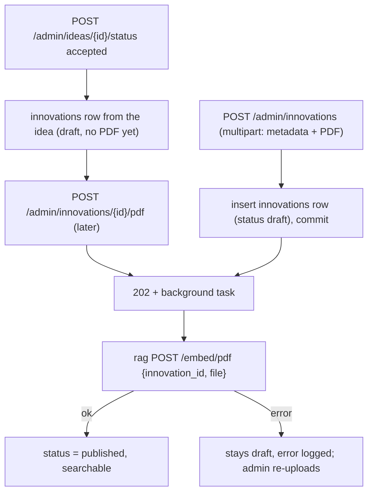
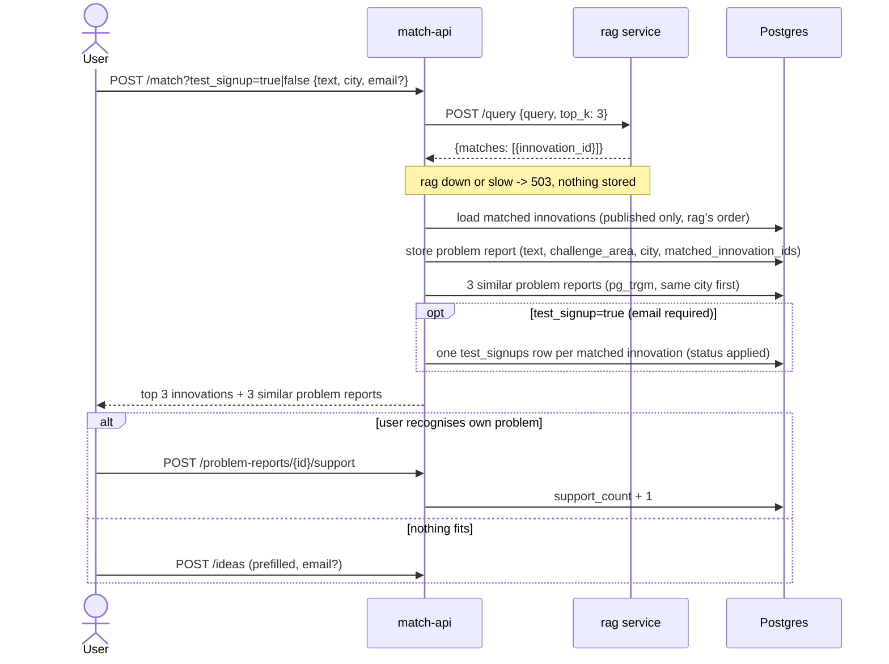
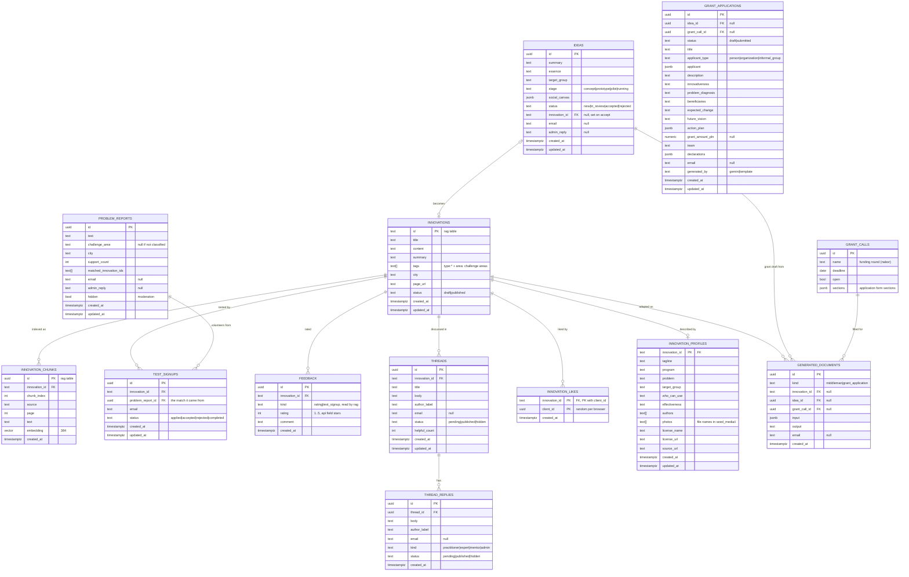

# Backend architecture: rag service + match-api

## Context

ROPS has ~200 social innovations that nobody can find. Matchmaking (problem text -> innovations) is the mandatory 10% of the score. Two small FastAPI services share one Postgres:
- the rag service (`rag/`): chunking, external embedding-service integration and retrieval. It is finished and is used as merged.
- match-api (`backend/`): the public API and the admin panel.

Inputs: `documentation/knowledge-base/CRITERIA-Wojewodztwo-Malopolskie-HUBMI.md`, `documentation/sample-data/` (8 innovations, 8 test queries), the shared team Notion page (`HackYeah`).

Principle: hackathon scope. Build the smallest thing that covers every requirement ([requirements-traceability.md](requirements-traceability.md)), with as few tables as possible. Anything that can be a SQL query on read is not a job. Deferred ideas are listed in section 8.

## 1. Components



| | rag service (`rag/`) | match-api (`backend/`) |
|---|---|---|
| Purpose | chunk one innovation and request external embeddings (`POST /embed`, `POST /embed/pdf`); retrieval (`POST /query`) | `/match` (calls rag `/query`, optional test signup), problem reports, ideas, threads, Middleman / grant drafts, admin (incl. PDF upload that triggers embedding) |
| Exposure | internal compose network only (no auth) | public + `/admin/*` |
| Writes | `innovation_chunks` | `innovations` rows (admin CRUD), `problem_reports`, `ideas`, `grant_calls`, `test_signups`, `feedback`, `threads`, `thread_replies`, `generated_documents`, `innovation_likes` |
| Down means | `/match` returns 503 and stores nothing; uploaded innovations stay draft until re-uploaded | site down |

How rag behaves, and what match-api does about it:
- **`POST /query {query, top_k ≤ 3, city?, title?}`:**
  - returns the best chunk per innovation, `status = 'published'` only
    - ranks results with equal weights: 50% vector similarity and 50% basic title match; `city` remains an optional filter
    - applies the configurable `MATCH_MIN_SCORE` cutoff to the combined score; Compose defaults it to `0.15` for permissive matching
- **Temporary `GET /query/test/{innovation_id}`:** reads one stored innovation, its tags, status, text, and chunk count for verifying test embeddings.
- **`POST /embed {innovation_id}`:**
  - needs an existing `innovations` row and replaces all of its chunks
  - match-api inserts and commits the row first, then calls it
- **Temporary `POST /embed/test {text}`:** creates a published `test-<uuid>` innovation, stores the plain text and its chunks, and returns the generated innovation ID; this is for model checks only.
- **Temporary `POST /llm/test {prompt, text}`:** sends a prompt and input text to the local Ollama model and returns its parsed output for model checks.
- Embeddings are generated by the separate `embeddings` container using `sentence-transformers/paraphrase-multilingual-MiniLM-L12-v2`; stored passages include title, summary, and content context.
- The `embeddings` container is built from `embeddings/Dockerfile`, which picks the TEI CPU image for the build platform (`cpu-1.9` on amd64, `cpu-arm64-1.9` on arm64/Apple Silicon); TEI has no multi-arch CPU tag.
- The temporary `/llm/test` endpoint uses the separate `ollama` container with `qwen2.5:1.5b`; the `ollama-init` container downloads the model into the persistent `ollama_models` volume.
- **`innovations.city` is nullable but returned as `str`:** match-api always writes `city` (`''` when unknown).

match-api calls rag directly over HTTP (`RAG_URL`); there is no queue between them. The `rabbitmq` service in compose is not used by match-api.

## 2. Flow: adding innovations

An innovation is visible to users only once rag has chunks for it, and a PDF from the admin is always the source.



- **Create from a PDF:** `POST /admin/innovations` takes the metadata (`title`, `summary`, `challenge_areas`, `tags`, `city`, `page_url`) plus the PDF.
  - match-api validates it (PDF, ≤ 10 MB, the same limits as rag), saves the file under `UPLOAD_DIR`, inserts the row as `draft`, commits, and returns 202 with the id.
  - A FastAPI background task then sends the PDF to rag `POST /embed/pdf`; on success match-api sets `status = 'published'`. The draft is committed first because rag looks the row up and replaces its chunks.
  - Trade-off: a background task instead of a queue. Simple and enough for a handful of uploads, but a process restart mid-embed loses the task (the row stays draft; the admin uploads again), and nothing retries.
  - Tags get `type:innovation` and one `area:<slug>` per challenge area, since rag filters only on tags.
- **Idea → innovation:** accepting an idea creates a `draft` innovations row from the idea card and stores it in `ideas.innovation_id`. It stays invisible until the admin uploads its PDF with `POST /admin/innovations/{id}/pdf`, which runs the same background embed.
- **Re-upload** replaces all chunks; editing metadata (`PATCH`) does not re-embed.
- **No job table:** the admin list shows `indexed` (has chunks, `EXISTS` on `innovation_chunks`) next to `status`. A failed embed leaves the row as an unindexed draft.
- **Seed data:** `rag/sql/007_seed_innovations.sql` inserts the 8 demo innovations from `documentation/sample-data/sample-social-innovations.json` as `published` (no PDF, `ON CONFLICT (id) DO NOTHING`, so admin edits survive re-runs). `rag/sql/008_seed_rops_library.sql` adds innovations scraped from the ROPS library (rops.krakow.pl, `media/scrape_rops_library.py`), with the film in `page_url`; their description sections go to `innovation_profiles` (`backend/sql/012_innovation_profiles.sql`) and two photos plus the main PDF per innovation to `backend/seed_media/<id>/`, copied into the api image. Both SQL files are generated by `media/build_app_seed.py`; ROPS categories map to challenge areas there (labour market -> `Ubostwo`). The one-shot compose `seed-embed` service (rag image, `python -m app.embed_missing`) waits for rag to be healthy and calls rag `POST /embed` for every published innovation that has no chunks, retrying on 503 while the embeddings model loads. Until it finishes, seeded rows are listed but not matched.

## 3. Flow: matchmaking and problem reports



Testing has two entry points. With `?test_signup=true` on `/match` the user volunteers to test the innovations matched for their problem: one `test_signups` row per returned innovation, linked to the problem report so the admin sees why; without an email the request returns 422. From an innovation page, `POST /innovations/{id}/test-signups {email, consent}` creates exactly one row for that innovation, with no problem report (`problem_report_id` null).

Ranking comes from rag; the LLM only explains and may cite only retrieved rows. User text is data, never instructions. The challenge area (one of the 8 Mapa areas) comes from a small LLM classification call, falling back to none.

## 4. Auth, contact and notifications

- **No public accounts.** An in-process per-IP rate limit guards public writes and `/match`; nothing about the IP is stored.
- **Optional email:** a problem report or idea may carry an `email` (with consent); `POST /match?test_signup=true` requires one. It is stored on the item itself. There is no contact table and there are no profile pages.
- **Admin replies** are an `admin_reply` column on the problem report or idea.
  - The admin sets it; if the item has an email, a notification email is sent.
  - A problem report reply is also shown on its public page, so it covers everyone who pressed "mnie też".
- **Notifier** (`app/services/notify/`): SMTP from env (`SMTP_HOST`, `SMTP_PORT`, `MAIL_FROM`, `WEB_URL`), a no-op if `SMTP_HOST` or `MAIL_FROM` is empty; no address has a default, so nothing is mailed until one is configured. Mailpit in compose by default (UI on :8025, synthetic addresses only); a real relay such as Gmail adds `SMTP_USERNAME` / `SMTP_PASSWORD` (STARTTLS + login). `MAIL_REDIRECT_TO` (testing) swaps the recipient for one test inbox; items without an email still get no mail. Services call it after their commit; it sends from a FastAPI background task, so the response never waits for SMTP. At-most-once: a failure is logged (without the address), not retried. The inbox stays the source of truth.
- **Only users who gave their own email get mail.** The admin is never emailed: new ideas, problem reports, pending threads and test signups wait in `GET /admin/inbox`, where the admin reviews and accepts them.
- **Mail format:** one Jinja2 layout (`notify/templates/mail.html` + `mail.txt`, autoescaped) sent as HTML with a plain-text part: the item quoted, the reply highlighted, next steps, one action button. Mails show only what helps the reader: no internal ids, and the coordinator's address never reaches users (no Reply-To); the test signup id appears only inside rating links, as the tester's token. An idea status mail goes out only for `accepted` / `rejected`. `python -m scripts.preview_mails [--send]` renders every mail with sample data.

| Event | Recipient |
|---|---|
| `admin_reply` set on an idea or problem report, idea status changed | the item's `email` |
| test signup accepted / completed | the signup's `email`; one "Oceń rozwiązanie" button to `{API_URL}/ratings/{signup_id}` (stars are on that page, not in the mail) |
| test signup rejected | the signup's `email` |
| thread published | the thread author's `email` |
| reply published | the reply author's and the thread author's `email` (once if the same) |
| grant call created open or opened | every distinct idea `email`, one mail each |

- **Admin side:** one shared admin login from env (`ADMIN_USERNAME`, `ADMIN_PASSWORD`; compose defaults to `admin` / `1234` for the demo), server-side sessions in memory, `HttpOnly; Secure; SameSite=Strict` cookie; see [.claude/designs/admin-auth.md](../../.claude/designs/admin-auth.md).
  - `require_admin` guards `/admin/*`.
  - `POST /admin/auth/login {username, password}`, `POST /admin/auth/logout`, `GET /admin/auth/me`.
  - Sessions: 8 h absolute, 30 min idle; login limited to 5 failures per username per 15 min; a foreign `Origin` on unsafe methods gets 403.

## 5. Admin endpoints (all under `/admin`, behind the admin session except login and logout)

| Feature | Endpoints |
|---|---|
| Auth | `POST /admin/auth/login` (public), `POST /admin/auth/logout`, `GET /admin/auth/me` |
| Innovations | `GET /admin/innovations` (filters `status`, `indexed`, `q`, `limit`, `offset`), `POST /admin/innovations` (multipart metadata + PDF, 202, §2), `GET /admin/innovations/{id}`, `PATCH /admin/innovations/{id}` (metadata only), `POST .../{id}/pdf` (replace the PDF under the same `{id}.pdf` name, 202; rag re-embeds in the background and replaces the chunks, on failure the old chunks stay; a successful embed publishes, like the first upload), `POST .../{id}/publish`, `POST .../{id}/unpublish`, `GET .../{id}/feedback` (rating avg/count, signups), `GET .../{id}/ratings` (every `feedback` row: `rating`, `comment`, `kind`, `created_at`, newest first), `GET .../{id}/stats` (matches total / 7d / by week, area and city, people reached, testers, rating distribution, matched problems) |
| Inbox | `GET /admin/inbox?since=`: new ideas, new problem reports, critical problem reports, new test signups, pending threads / replies |
| Ideas | `GET /admin/ideas` (filter `status`), `GET /admin/ideas/{id}`, `POST .../{id}/reply`, `POST .../{id}/status` (`accepted` creates a draft innovation, §2) |
| Problem reports | `GET /admin/problem-reports` (filters `challenge_area`, `city`), `GET /admin/problem-reports/{id}`, `POST .../{id}/reply`, `POST .../{id}/hide` |
| Threads | `GET /admin/threads` (filter `innovation_id`, and `status`, which matches the thread or any of its replies, so `?status=pending` is the moderation queue; each thread carries all its replies), `POST .../{id}/status` (`published`\|`hidden`), `POST .../replies/{id}/status` (same body) |
| Testing | `GET /admin/test-signups` (filter `innovation_id`, `status`; statuses `applied`, `accepted`, `rejected`, `completed`, `rated`), `POST /admin/test-signups/{id}/status` (`accepted`\|`rejected`\|`completed`; `rated` is set by the tester's rating) |
| Grant calls | `GET /admin/grant-calls`, `POST /admin/grant-calls`, `PATCH /admin/grant-calls/{id}` (open/close, form sections) |
| Generated docs | `GET /admin/generated-documents` (filter `kind`, `innovation_id`, `idea_id`) |
| Reports | `GET /admin/reports/trends`, `/critical`, `/locations`, `/gaps`, `/innovations` (one stats row per innovation), each with `?format=json\|csv` |

### Reports are queries, not jobs

| Report | Query |
|---|---|
| trends | problem reports (+ `support_count`) by challenge area / city / week |
| critical | score = problem reports x distinct cities x growth ratio (last 7d vs previous 7d), computed on read |
| locations | per-city counts by challenge area |
| gaps | problem reports with no matched innovation (empty `matched_innovation_ids`) |
| innovations | per innovation: problem reports whose `matched_innovation_ids` contain it (total, 7d, previous 7d, distinct cities, + `support_count` = people reached), test signups by status, rating avg / count |

CSV export is a streaming response. Cities with fewer than 5 problem reports are shown as "too few to display".

### Public endpoints (no auth; per-IP rate limit on writes)

| Feature | Endpoints |
|---|---|
| Matching | `POST /match?test_signup=` `{text, city, email?, consent}` → `{problem_report_id, answer, innovations, similar_reports, test_signup_ids}` (`answer` is rag's one summary for the whole result); `test_signup=true` needs an email (422 otherwise) |
| Problem reports | `GET /problem-reports/{id}` (public page with `admin_reply`), `POST /problem-reports/{id}/support` ("mnie też") |
| Ideas | `POST /ideas` `{summary, essence, target_group, stage, social_canvas?, email?, consent}`, `POST /ideas/{id}/grant-application {grant_call_id, applicant_type?}` → full Zał. 3 JSON (AI fills 1+3–9; empty typed §2/§10–12 for FE edit), `GET/PATCH /grant-applications/{id}` (user may edit every field incl. LLM text) |
| Library | `GET /innovations` (published only; filters `challenge_area`, `q`, `limit`, `offset`), `GET /innovations/{id}` (with `rating_avg`, `rating_count`, `has_pdf` and the `innovation_profiles` fields: `tagline`, `program`, `problem`, `target_group`, `who_can_use`, `effectiveness`, `authors`, `photos`, `license_name`, `license_url`, `source_url`), `GET /innovations/{id}/pdf` (the whole PDF as a download, `Content-Disposition: attachment`: the admin upload in `upload_dir` if there is one, else `seed_media/<id>/document.pdf`; 404 for drafts or when there is no file), `GET /innovations/{id}/photos/{name}` (only names listed in `photos`, from `seed_media/<id>/`; 404 for drafts and unlisted names), `POST /innovations/{id}/feedback {stars, comment, test_signup_id?}`, `POST /innovations/{id}/test-signups {email, consent}` (201, one `applied` signup; 404 for drafts), `GET /innovations/{id}/likes?client_id=` (`{like_count, liked}`), `PUT /innovations/{id}/likes/{client_id}` (like, idempotent), `DELETE /innovations/{id}/likes/{client_id}` (unlike); 404 for drafts, 422 when `client_id` is not a uuid |
| Threads | `GET /innovations/{id}/threads` (published threads + published replies), `POST /innovations/{id}/threads` (202, `pending`), `POST /threads/{id}/replies` (202, `pending`) |
| Middleman | `POST /middleman {innovation_id, institution_type, needs, email?, consent}` (the response is the stored document) |
| Grant calls | `GET /grant-calls` (open only) |
| Tester rating (HTML, not in OpenAPI) | `GET /ratings/{signup_id}` shows the rating form (optional `?rating=N` preselects a star); `POST /ratings/{signup_id}` (form `stars`, `comment`) stores one `feedback` row (`kind='test_signup'`) and moves the signup to `rated`. The signup id is the token; only `accepted` / `completed` signups can rate, once. Opening the link stores nothing, so mail link scanners can't rate. |

Admin and public services are db-backed (`backend/app/services/{admin,public}/db.py`, one session per request via `get_db`); the mocks in `mock.py` stay for unit tests through dependency overrides.
- `/match` uses rag `/query` (`backend/app/clients/rag.py`). Grant-application drafts call Gemini (`backend/app/clients/gemini.py`, JSON fields 1+3–9 from the ROPS form) with a template fallback when the key is missing or the API fails; Middleman cards are still templates (`backend/app/services/public/drafts.py`).
- The admin problem report response keeps `location`, `is_critical` and `criticality_score` for the admin frontend: `location` is filled from `city`, criticality is computed on read (score ≥ 10 is critical).

## 6. Data model

Two rag tables (used as merged), plus flat match-api tables. match-api also extends `innovations` with extra columns that rag ignores at query time (rag still filters on `tags`, `city`, `status`).



- **Innovations** are rag's table as-is (`rag/sql`); match-api maps exactly its columns and adds none. Films link through `page_url`. rag aliases `page_url` as `parent_url` in responses only.
- **Tags:** every row carries `type:innovation` or `type:report` (ROPS reports and Mapa Wyzwań PDFs), so reports never show up in `/match`. Challenge areas are stored only as `area:<slug>` tags; the API's `challenge_areas` is read from them.
- **Taxonomy:** the 8 Mapa challenge areas (Rodzina i piecza zastepcza, Bezdomnosc, Niepelnosprawnosc, Ubostwo, Integracja cudzoziemcow, Zdrowie, Zdrowie psychiczne, Seniorzy).
- **city** = gmina, picked from a fixed list. Free-text city spellings are rejected on write.
- **Criticality** is not stored: reports compute it on read (problem reports × distinct cities × 7d growth).
- **Threads** are per-innovation community discussions (R5). No public accounts: `author_label` + optional `email`. Flat replies only (no nested reply trees). `helpful_count` stays in the table, but the public "pomocne" endpoint is deferred, so nothing increments it yet. Public replies are always `practitioner`; `expert` / `mentor` / `admin` are set by ROPS. Public lists show `published` only; `pending` waits for ROPS moderation.
- **Innovation profiles** (`innovation_profiles`, match-api's) hold the library page sections rag's `innovations` has no columns for; the solution text stays in `innovations.summary`, so the admin's summary edit is what the detail page shows. Innovations without a profile (admin uploads) return empty fields. The admin cannot edit profiles yet.
- **Likes** (`innovation_likes`) are anonymous: the browser keeps a random `client_id` uuid in localStorage, one row per (innovation, browser), so a like can be taken back. The count is shown on the public detail page only.
- **Generated documents** store Middleman service cards (legacy grant drafts may still appear with `kind=grant_application`). Full ROPS Zał. 3 forms live in **`grant_applications`**. Every GET/POST/PATCH returns the complete editable shape: typed `applicant` (person a–g / organization a–k / informal partners 1–5), narrative fields 1+3–8, `action_plan` (prep + test I/II steps with cost), `grant_amount_pln`, `team`, and per-checkbox `declarations` (A person / B organization). AI pre-fills 1+3–9; user edits anything before `status=submitted`. Not submitted to an external grant DB (deferred).
- **Naming:** always `city` (not `location`), always `stars` on feedback in the API (rag column `rating`).

Public endpoints that write the new tables: `POST /innovations/{id}/threads`, `POST /threads/{id}/replies`, `POST /middleman`, grant generator on an idea (both persist a `generated_documents` row).

## 7. Failure modes

| Failure | Handling |
|---|---|
| rag service down | `/match` returns 503 and stores nothing, so the user can retry; a stored report with no matches would show up as a false gap |
| background `/embed/pdf` fails (rag down, bad PDF) | the row stays an unindexed draft, the error is logged; the admin re-uploads the PDF |
| process restarts during a background embed | same as a failure: the row stays draft, the admin re-uploads (no job table) |
| LLM down | rag `/query` still returns matches with `answer: ""`; `/match` shows cards only; grant drafts fall back to template; optional `/llm/test` returns 503 |
| spam on public routes | per-IP rate limit, input length caps |
| prompt injection | user text treated as data, explanations limited to retrieved rows |
| SMTP unset or down | email skipped; the admin still sees the inbox, the reply is on the public page |
| "mnie też" or ratings sent many times | inflated `support_count` (feeds criticality) and `rating_avg`; the per-IP rate limit on public writes is a blocker before a live launch |
| likes from cleared storage or many browsers | inflated like count; it is a public signal only and feeds no report; per-IP rate limit before a live launch |
| spam threads or replies | per-IP rate limit; default `pending` until admin publishes |
| Postgres down | everything down; accepted for MVP |

## 8. Deferred (add only when needed)

| Idea | Add when |
|---|---|
| contacts table, profile pages, nested reply trees | flat threads + one `admin_reply` column are not enough |
| outbox, worker, webhooks to the grant DB | real integration is needed |
| admin accounts and sessions in Postgres | more than one match-api replica |
| test rounds, verified tester reports | ROPS runs real testing rounds |
| submitting grant applications into an external system | applications leave the platform |
| report snapshots / materialized views | report queries get slow |
| per-user likes (instead of counters) | anonymous inflation becomes a real problem |

## 9. Layout and build order

```
backend/             # match-api
  app/               # api/*.py, api/admin/*.py, schemas/, services/ (interface + mock first, db next), rag client
  sql/               # match-api tables only; compose `migrate` applies rag/sql then this
rag/                 # used as merged
embeddings/          # arch-aware TEI image (Dockerfile only)
docker-compose.yml   # postgres (pgvector image), migrate, rag, seed-embed, embeddings, ollama, api, mailpit
```

1. Backend schema file + compose (one `DATABASE_URL`, `RAG_URL`, mailpit): match-api tables + `innovations` column extensions.
2. Admin innovations on rag's table: PDF upload + background `/embed/pdf` + auto-publish; idea accept creates a draft innovation
3. `/match` calling rag `/query` and returning its answer; the 8 sample queries pass.
4. Problem reports, support, similar reports; admin problem reports + reply + hide.
5. Ideas + admin ideas, inbox, notifier.
6. Threads + replies (public write, admin moderate); wire innovation detail page off the API.
7. Reports (SQL) + CSV.
8. `test_signup` on `/match`, feedback (optional `test_signup_id`), grant calls + generator, Middleman — both LLM outputs stored in `generated_documents`.

## 10. Verification

- Unit: rag client errors -> 503, `require_admin` (admin / none), rate limit (429 over the limit).
- Regression: the 8 queries in `sample-matchmaking-queries.md` return the expected id in the top 3.
- Integration:
  - `docker compose up`, upload innovations through the admin, curl `/match`
  - draft innovations and `type:report` rows are never returned
  - with rag stopped, `/match` returns 503 and no problem report is stored
  - every `/admin/*` route returns 401 without a session (parametrised test)
  - pending threads stay invisible on the public innovation page until published

## 11. Open questions

1. Can we scrape the Biblioteka Innowacji, or do we stay on sample data plus hand-curated entries?
2. The ROPS PDFs (Mapa Wyzwan, Canvas, reports) need downloading by hand into the repo.
3. Things for the rag owner (rag stays as merged):
   - `all-MiniLM-L6-v2` is English-only and the content is Polish (a 384-dim multilingual MiniLM is a drop-in without changing `vector(384)`)
   - the title/tag boost only fires when the whole query is a substring
   - a null `city` makes `/query` fail with 500 — match-api always writes `city` (`''` when unknown)

## Changes

1. Admin auth: server-side session cookie instead of a shared JWT; for the hackathon one shared login from env (`ADMIN_USERNAME` / `ADMIN_PASSWORD`).
2. IP logic removed; an optional email is stored on the item for notifications.
3. The rag service owns chunking, embedding and retrieval; `/match` calls it over HTTP and receives innovation IDs only; rag down gives 503 and nothing is stored.
4. Data model: merged rag tables + match-api tables (`problem_reports`, `ideas`, `grant_calls`, `test_signups`, `feedback`, `threads`, `thread_replies`, `generated_documents`):
   - the email and `admin_reply` live on the item; problem reports also have `hidden`
   - "mnie też" is a counter; thread "pomocne" is deferred
   - innovations are rag's table as-is; challenge areas live in `area:<slug>` tags
   - `location` is renamed to `city`; cities come from a fixed list
   - criticality is computed on read, not stored
   - Middleman and grant drafts are stored in `generated_documents`
   - community threads are first-class (pending moderation, flat replies, role `kind`)
   - contacts, nested reply trees, test rounds, per-item tokens and index jobs stay deferred
5. RabbitMQ added to docker compose (`rabbitmq`, `RABBITMQ_URL` passed to the api); no publisher in match-api yet.
6. Public `GET /innovations/{id}/pdf` serves a published innovation's source PDF; `GET /innovations/{id}` reports `has_pdf` so the UI shows the link only when the file exists.
5. Innovation upload calls rag `POST /embed/pdf` directly from a background task and publishes the innovation on success; no queue between match-api and rag.
6. One schema definition: each table is defined once by its owner. rag owns `innovations`, `innovation_chunks` and `feedback` (`rag/sql`); match-api owns only its own tables (`backend/sql`) and maps rag's tables exactly, adding no columns. Dropped from innovations: `problem`, `innovator`, `target_group`, `readiness`, `cost_level`, `video_url`, `image_url`; `challenge_areas` is read from `area:<slug>` tags. A one-shot compose `migrate` service applies `rag/sql` then `backend/sql` on every `up`, before `rag` and `api` start; the `docker/postgres/init` copies are gone. match-api writes rag's `feedback`: API `stars` maps to `rating`, tester feedback is `kind='test_signup'`; the signup id is validated but not stored.
7. `embeddings` is built from `embeddings/Dockerfile` instead of pulling `text-embeddings-inference:cpu-1.8` (amd64-only); it selects the TEI 1.9 CPU image per architecture so compose runs on Linux amd64 and Apple Silicon.
8. Demo innovations are seeded: `rag/sql/007_seed_innovations.sql` inserts the sample-data innovations and compose `seed-embed` embeds published innovations without chunks via rag `POST /embed`.
9. `/match` retrieves through rag `/query` (embeddings), not word overlap. LLM experimentation is isolated to the temporary `/llm/test` endpoint.
10. Email notifier implemented (§4) with Mailpit in compose; it mails only users who left their own email (no admin mail, the admin works from the inbox); published replies also notify the thread author, and opening a grant call mails idea authors. `GET /admin/inbox` returns `pending_threads` and `new_test_signups` (status `applied`). Notifications are HTML with one action each; `GET /admin/test-signups` and `POST /admin/test-signups/{id}/status` exist and mail the tester (rating links). Testers rate straight from the mail through `/ratings/{signup_id}` (HTML page served by match-api, `API_URL` setting), so rating does not depend on the frontend.
11. rag's `/query` no longer returns `answer`; the match-api client treats it as optional (empty string), so `/match` keeps working. `GET /admin/innovations/{id}/ratings` lists all ratings of an innovation for the admin innovation page.
12. Direct test signup: `POST /innovations/{id}/test-signups` signs up for one innovation (the innovation page used `/match?test_signup=true`, which signs up for every match). `backend/sql/010_test_signup_direct.sql` makes `test_signups.problem_report_id` nullable.
13. Anonymous innovation likes: `innovation_likes` table (`backend/sql/011_innovation_likes.sql`) and `GET/PUT/DELETE /innovations/{id}/likes` keyed by a browser-generated `client_id`; the detail page ActionBar shows a like toggle with the count.
14. `POST /admin/innovations/{id}/pdf` (documented, but missing from the code) is implemented; the admin edit page `/admin/innowacje/{id}/edytuj` takes an optional new PDF.
15. Innovations from the ROPS library are seeded with description profiles (`innovation_profiles`, `backend/sql/012_innovation_profiles.sql`), two photos and the main PDF each (`backend/seed_media/`); `GET /innovations/{id}/photos/{name}` serves the photos and `GET /innovations/{id}/pdf` became a download that falls back to the seeded PDF.
