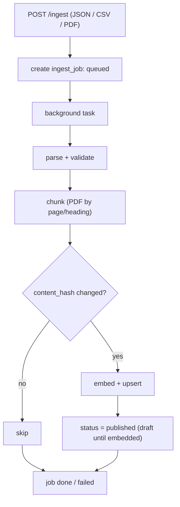
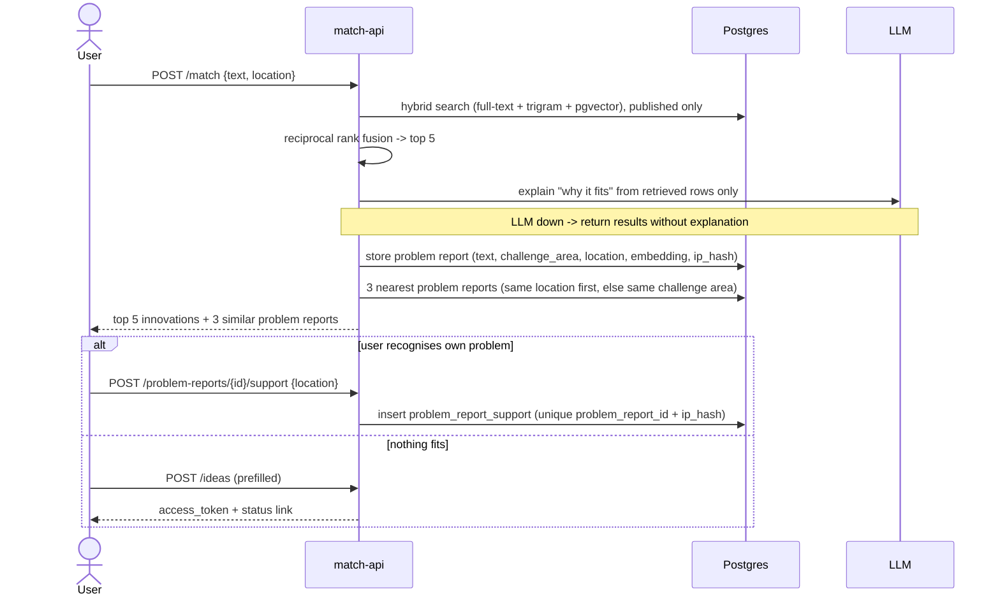
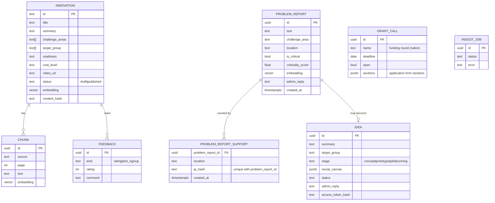

# Backend architecture: ingest-service + match-api

## Context

ROPS has ~200 social innovations that nobody can find. Matchmaking (problem text -> innovations) is the mandatory 10% of the score and must be fast. Importing and indexing content (innovations, reports, Mapa Wyzwan) is slow, admin-only work. So: two small FastAPI services on one Postgres.

Inputs: `documentation/CRITERIA-Wojewodztwo-Malopolskie-HUBMI.md`, `documentation/sample-data/` (8 innovations, 8 test queries), the shared team Notion page (`HackYeah`).

Principle: build the smallest thing that covers every requirement ([requirements-traceability.md](requirements-traceability.md)). Anything that can be a SQL query on read is not a job. Deferred ideas are listed in section 8.

## 1. Components


| | ingest-service | match-api |
|---|---|---|
| Purpose | import, parse, chunk, embed, upsert | matching, problem reports, ideas, admin |
| Exposure | admin only (same JWT dependency) | public + `/admin/*` |
| Writes | `innovation`, `chunk`, `ingest_job` | `problem_report`, `problem_report_support`, `idea`, `feedback`, `innovation` (admin edits) |
| Down means | no new imports; matching unaffected | users blocked; imports unaffected |

Services share only the DB and a small `common/` package (models, embeddings, auth dependency). match-api never calls ingest.

## 2. Flow: ingest



FastAPI background task plus an `ingest_job` row the admin UI polls. Re-running is safe (upsert by content hash). Sources in order: sample JSON, CSV, PDFs (Mapa Wyzwan, Canvas, reports). Library scrape only if ROPS allows it.

## 3. Flow: matchmaking and problem reports



Ranking is deterministic; the LLM only explains and may cite only retrieved rows. User text is data, never instructions. Challenge area (one of the 8 Mapa areas) is picked by a small LLM classification call, with a fallback to none.

## 4. Auth and IP middleware

- **Public side has no users.** IP middleware on public routes: resolve client IP (`X-Forwarded-For` only from our proxy), hash with a server-side salt, never store the raw IP. It rate limits per `ip_hash` and gives dedupe through a unique `(problem_report_id, ip_hash)` on `problem_report_support`.
- Known limits: shared NAT undercounts, VPN inflates. Acceptable; criticality also needs several locations.
- **Admin side:** JWT with `role=admin`, one shared dependency (`require_admin`) used by `/admin/*` and `/ingest/*`: 401 without a token, 403 otherwise. Token is obtained from public `POST /admin/auth/login {username, password} -> {access_token, token_type}`; credentials and signing key from env.
- **Replies without accounts:** an idea returns a random `access_token` (stored hashed); `GET /ideas/{token}` shows status and the admin reply. An problem report reply is stored on the problem report and shown to everyone who created or supported it, so one reply covers the whole cluster.
- **Email notifier (MVP, optional):** one email to the admin on a new idea and when an problem report first crosses the critical threshold. SMTP settings from env, sent via FastAPI `BackgroundTasks`, no-op if unset. At-most-once, best effort; the inbox stays the source of truth.

## 5. Admin endpoints (all under `/admin`, behind the JWT dependency except login)

| Feature | Endpoints |
|---|---|
| Auth | `POST /admin/auth/login` (public) |
| Innovations | `GET /admin/innovations` (filters `status`, `q`, `limit`, `offset`), `POST /admin/innovations`, `GET /admin/innovations/{id}`, `PATCH /admin/innovations/{id}`, `POST .../{id}/publish`, `POST .../{id}/unpublish`, `GET .../{id}/feedback` (rating avg/count, test signups). Edit embeds inline, so it is searchable at once |
| Inbox | `GET /admin/inbox?since=`: new ideas, new and critical problem reports since the timestamp. This is how the admin learns of new items |
| Ideas | `GET /admin/ideas` (filter `status`), `GET /admin/ideas/{id}`, `POST .../{id}/reply`, `POST .../{id}/status` |
| Problem reports | `GET /admin/problem-reports` (filters `challenge_area`, `location`, `is_critical`), `GET /admin/problem-reports/{id}`, `POST .../{id}/reply` |
| Grant calls | `GET /admin/grant-calls`, `POST /admin/grant-calls`, `PATCH /admin/grant-calls/{id}` (open/close, form sections) |
| Reports | `GET /admin/reports/trends`, `/critical`, `/locations`, `/gaps`, each with `?format=json\|csv` |

Import stays in ingest-service: `POST /ingest/*`, `GET /ingest/jobs/{id}`. The grant application generator is available only while a `grant_call` is open.

### Reports are queries, not jobs

All report endpoints are SQL aggregates on request; at this data size there is no need for snapshots or workers.

| Report | Query |
|---|---|
| trends | count problem reports + support by challenge area / location / week |
| critical | score = problem reports x distinct locations x growth ratio (last 7d vs previous 7d); over a threshold flags it in the inbox |
| locations | per-location counts by challenge area |
| gaps | problem reports whose best innovation match is below a similarity threshold (what ROPS should look for) |

CSV export is a streaming response. Locations with fewer than 5 problem reports are shown as "too few to display". If queries ever get slow, add a materialized view (section 8).

## 6. Data model



Taxonomy: the 8 Mapa challenge areas (Rodzina i piecza zastepcza, Bezdomnosc, Niepelnosprawnosc, Ubostwo, Integracja cudzoziemcow, Zdrowie, Zdrowie psychiczne, Seniorzy).

- location = gmina, picked from a fixed list; no coordinates or geolocation
- challenge area = one of the 8 Mapa areas above
- problem report = a user-submitted problem; "me too" presses are `problem_report_support` rows (`support_count`)
- idea stage: concept, prototype, pilot, running; innovation `status`: draft or published (`PublicationStatus`)

## 7. Failure modes

| Failure | Handling |
|---|---|
| ingest-service down | matching and browsing unaffected (DB-only coupling) |
| LLM down | return retrieval results without explanation or challenge area |
| ingest crashes mid-job | items stay `draft` until embedded; re-run is idempotent |
| spam on public routes | IP rate limit, input length caps |
| prompt injection | user text treated as data, structured output validated, explanations limited to retrieved rows |
| SMTP unset or down | notification skipped; admin still sees items in the inbox |
| problem report reply, no accounts | no push to authors; they see the reply when they revisit the problem report page |
| Postgres down | everything down; accepted for MVP |

## 8. Deferred (add only when needed)

| Idea | Add when |
|---|---|
| separate worker, scheduler, outbox, webhooks, multiple notification channels | the inbox + single email is not enough, or a real integration (grant DB) is needed |
| report snapshots / materialized views | report queries get slow |
| PDF report export, per-location reports with Obserwator indicators | after the MVP works end to end |
| semantic clustering of problem reports (centroids) | similarity lookup is not enough |
| voice / photo intake, chat intents, glossary / semantic layer | time remains |
| real queue (RabbitMQ) for ingest | background tasks no longer cope |

## 9. Layout and build order

```
backend/
  app/       # match-api: api/{match,problem_reports,ideas,feedback}.py, api/admin/*.py, services/, middleware/ip.py
  ingest/    # main.py, services/{parsers,chunker,importer}.py
  common/    # models, db session, settings, auth dependency, embeddings
  migrations/
docker-compose.yml   # + ingest, postgres (pgvector image)
```

Admin code in the current FastAPI app:

```
app/
  auth.py                # require_admin dependency
  api/admin/             # auth, innovations, inbox, ideas, problem_reports, grant_calls, reports .py
  schemas/admin/
  services/admin/        # interface + mock implementation first, DB-backed later
```

New deps (pinned, separate commit): sqlalchemy, psycopg, pgvector, fastembed, pypdf, pyjwt, anthropic.

1. Schema, `common/`, compose.
2. ingest: JSON import -> embed -> upsert; load the 8 samples.
3. `/match` with hybrid retrieval (no LLM); the 8 sample queries pass.
4. LLM explanation + challenge area classification, with fallback.
5. IP middleware, problem reports, support, similar problem reports.
6. Admin auth, innovations CRUD, inbox, ideas and replies.
7. Reports (SQL) + CSV.
8. PDF ingestion, "ask the report", grant calls and application generator, feedback.

## 10. Verification

- Unit: chunker, parsers, rank fusion, auth dependency (admin / non-admin / none), IP middleware (dedupe, rate limit).
- Regression: the 8 queries in `sample-matchmaking-queries.md` return the expected id in the top 3.
- Integration: `docker compose up`, import samples, curl `/match`; unpublished items never returned; every `/admin/*` and `/ingest/*` route returns 401/403 without an admin token (parametrised test).
- Idempotency: same import twice leaves counts unchanged; same IP supporting the same problem report twice counts once.

## 11. Open questions

1. Can we scrape the Biblioteka Innowacji, or do we stay on sample data plus hand-curated entries?
2. The ROPS PDFs (Mapa Wyzwan, Canvas, reports, RULES) are only linked in Notion. They need downloading by hand (the site blocks the default fetcher) into the repo.

## Changes (after Notion brief comparison)

1. Admin login endpoint added (`POST /admin/auth/login`), so a JWT can be obtained.
2. Admin endpoint table completed (innovation get/unpublish/feedback, inbox `since`, idea/problem report detail and filters, report `format`).
3. Single optional email notifier moved from deferred into the MVP; webhooks/outbox/worker stay deferred.
4. Similar problem reports: 3 nearest, same location first, falling back to same challenge area.
5. Problem report reply clarified as cluster reply (stored on the problem report, seen by all authors/supporters, no push).
