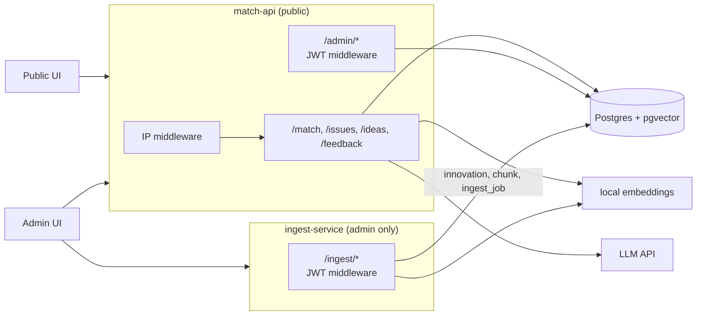
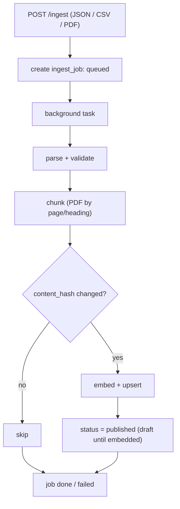
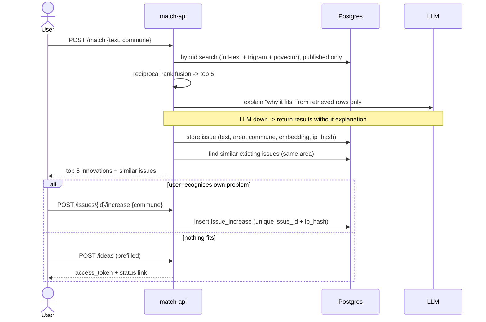
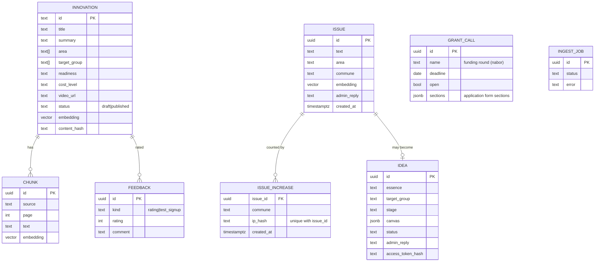

# Backend architecture: ingest-service + match-api

## Context

ROPS has ~200 social innovations that nobody can find. Matchmaking (problem text -> innovations) is the mandatory 10% of the score and must be fast. Importing and indexing content (innovations, reports, Mapa Wyzwan) is slow, admin-only work. So: two small FastAPI services on one Postgres.

Inputs: `documentation/CRITERIA-Wojewodztwo-Malopolskie-HUBMI.md`, `documentation/sample-data/` (8 innovations, 8 test queries), the shared team Notion page (`HackYeah`).

Principle: build the smallest thing that covers every requirement ([requirements-traceability.md](requirements-traceability.md)). Anything that can be a SQL query on read is not a job. Deferred ideas are listed in section 8.

## 1. Components



| | ingest-service | match-api |
|---|---|---|
| Purpose | import, parse, chunk, embed, upsert | matching, issues, ideas, admin |
| Exposure | admin only (same JWT dependency) | public + `/admin/*` |
| Writes | `innovation`, `chunk`, `ingest_job` | `issue`, `issue_increase`, `idea`, `feedback`, `innovation` (admin edits) |
| Down means | no new imports; matching unaffected | users blocked; imports unaffected |

Services share only the DB and a small `common/` package (models, embeddings, auth dependency). match-api never calls ingest.

## 2. Flow: ingest



FastAPI background task plus an `ingest_job` row the admin UI polls. Re-running is safe (upsert by content hash). Sources in order: sample JSON, CSV, PDFs (Mapa Wyzwan, Canvas, reports). Library scrape only if ROPS allows it.

## 3. Flow: matchmaking and issues



Ranking is deterministic; the LLM only explains and may cite only retrieved rows. User text is data, never instructions. Area (one of the 8 Mapa areas) is picked by a small LLM classification call, with a fallback to none.

## 4. Auth and IP middleware

- **Public side has no users.** IP middleware on public routes: resolve client IP (`X-Forwarded-For` only from our proxy), hash with a server-side salt, never store the raw IP. It rate limits per `ip_hash` and gives dedupe through a unique `(issue_id, ip_hash)` on `issue_increase`.
- Known limits: shared NAT undercounts, VPN inflates. Acceptable; criticality also needs several communes.
- **Admin side:** JWT with `role=admin`, one shared dependency in `common/auth.py` used by `/admin/*` and `/ingest/*`: 401 without a token, 403 otherwise. Credentials and signing key from env.
- **Replies without accounts:** an idea returns a random `access_token` (stored hashed); `GET /ideas/{token}` shows status and the admin reply. Issue replies are shown on the issue page.

## 5. Admin endpoints (all behind JWT middleware)

| Area | Endpoints |
|---|---|
| Innovations | `GET/POST /admin/innovations`, `PATCH /admin/innovations/{id}`, `POST .../publish` (edit embeds inline, so it is searchable at once) |
| Import | `POST /ingest`, `GET /ingest/jobs/{id}` (ingest-service) |
| Inbox | `GET /admin/inbox`: new ideas, new and critical issues since last seen. This is how the admin learns of new items |
| Ideas | `GET /admin/ideas`, `POST /admin/ideas/{id}/reply`, `POST .../status` |
| Issues | `GET /admin/issues`, `POST /admin/issues/{id}/reply` |
| Grant calls | `GET/POST /admin/grant-calls`, `PATCH /admin/grant-calls/{id}` (open/close, form sections) |
| Reports | `GET /admin/reports/trends`, `/critical`, `/communes`, `/gaps`, each with `?format=csv` |

### Reports are queries, not jobs

All report endpoints are SQL aggregates on request; at this data size there is no need for snapshots or workers.

| Report | Query |
|---|---|
| trends | count issues + increases by area / commune / week |
| critical | score = issues x distinct communes x growth (last 7d vs previous 7d); over a threshold flags it in the inbox |
| communes | per-commune counts by area |
| gaps | issues whose best innovation match is below a similarity threshold (what ROPS should look for) |

CSV export is a streaming response. Communes with fewer than 5 issues are shown as "too few to display". If queries ever get slow, add a materialized view (section 8).

## 6. Data model



Taxonomy: the 8 Mapa areas (Rodzina i piecza zastepcza, Bezdomnosc, Niepelnosprawnosc, Ubostwo, Integracja cudzoziemcow, Zdrowie, Zdrowie psychiczne, Seniorzy). Commune is chosen from a list; no geolocation.

## 7. Failure modes

| Failure | Handling |
|---|---|
| ingest-service down | matching and browsing unaffected (DB-only coupling) |
| LLM down | return retrieval results without explanation or area |
| ingest crashes mid-job | items stay `draft` until embedded; re-run is idempotent |
| spam on public routes | IP rate limit, input length caps |
| prompt injection | user text treated as data, structured output validated, explanations limited to retrieved rows |
| Postgres down | everything down; accepted for MVP |

## 8. Deferred (add only when needed)

| Idea | Add when |
|---|---|
| separate worker, scheduler, outbox, email/webhook notifications | the inbox is not enough, or a real integration (grant DB) is needed |
| report snapshots / materialized views | report queries get slow |
| PDF report export, per-commune reports with Obserwator indicators | after the MVP works end to end |
| semantic clustering of issues (centroids) | similarity lookup is not enough |
| voice / photo intake, chat intents, glossary / semantic layer | time remains |
| real queue (RabbitMQ) for ingest | background tasks no longer cope |

## 9. Layout and build order

```
backend/
  app/       # match-api: api/{match,issues,ideas,feedback}.py, api/admin/*.py, services/, middleware/ip.py
  ingest/    # main.py, services/{parsers,chunker,importer}.py
  common/    # models, db session, settings, auth dependency, embeddings
  migrations/
docker-compose.yml   # + ingest, postgres (pgvector image)
```

New deps (pinned, separate commit): sqlalchemy, psycopg, pgvector, fastembed, pypdf, pyjwt, anthropic.

1. Schema, `common/`, compose.
2. ingest: JSON import -> embed -> upsert; load the 8 samples.
3. `/match` with hybrid retrieval (no LLM); the 8 sample queries pass.
4. LLM explanation + area classification, with fallback.
5. IP middleware, issues, increase, similar issues.
6. Admin auth, innovations CRUD, inbox, ideas and replies.
7. Reports (SQL) + CSV.
8. PDF ingestion, "ask the report", grant calls and application generator, feedback.

## 10. Verification

- Unit: chunker, parsers, rank fusion, auth dependency (admin / non-admin / none), IP middleware (dedupe, rate limit).
- Regression: the 8 queries in `sample-matchmaking-queries.md` return the expected id in the top 3.
- Integration: `docker compose up`, import samples, curl `/match`; unpublished items never returned; every `/admin/*` and `/ingest/*` route returns 401/403 without an admin token (parametrised test).
- Idempotency: same import twice leaves counts unchanged; same IP increasing the same issue twice counts once.

## 11. Open questions

1. Can we scrape the Biblioteka Innowacji, or do we stay on sample data plus hand-curated entries?
2. The ROPS PDFs (Mapa Wyzwan, Canvas, reports, RULES) are only linked in Notion. They need downloading by hand (the site blocks the default fetcher) into the repo.
