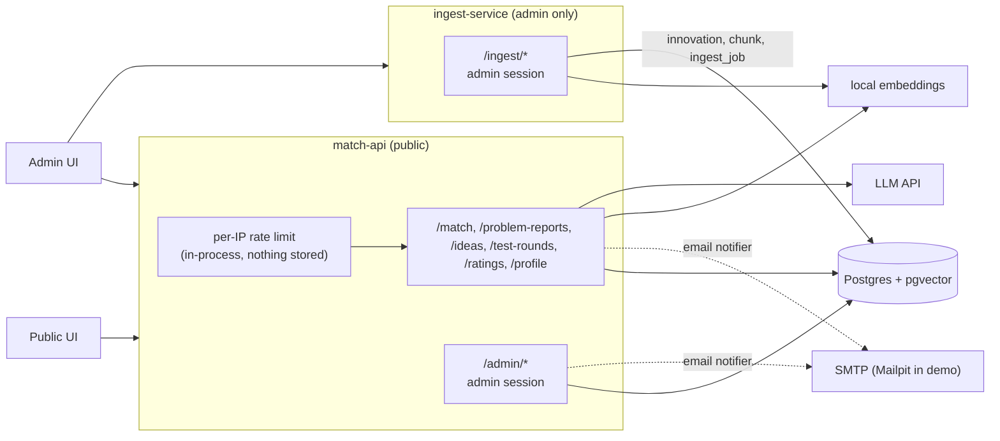
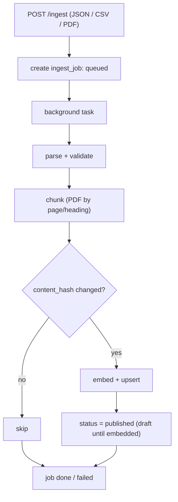
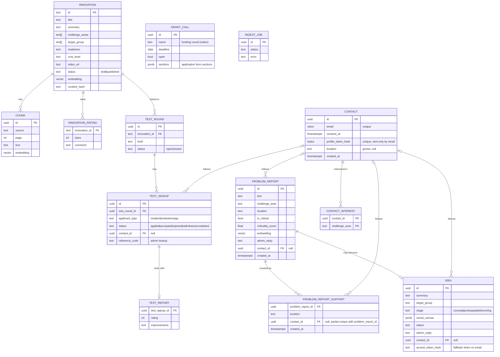

# Backend architecture: ingest-service + match-api

## Context

ROPS has ~200 social innovations that nobody can find. Matchmaking (problem text -> innovations) is the mandatory 10% of the score and must be fast. Importing and indexing content (innovations, reports, Mapa Wyzwan) is slow, admin-only work. So: two small FastAPI services on one Postgres.

Inputs: `documentation/CRITERIA-Wojewodztwo-Malopolskie-HUBMI.md`, `documentation/sample-data/` (8 innovations, 8 test queries), the shared team Notion page (`HackYeah`).

Principle: build the smallest thing that covers every requirement ([requirements-traceability.md](requirements-traceability.md)). Anything that can be a SQL query on read is not a job. Deferred ideas are listed in section 8.

## 1. Components



| | ingest-service | match-api |
|---|---|---|
| Purpose | import, parse, chunk, embed, upsert | matching, problem reports, ideas, admin |
| Exposure | admin only (same session dependency) | public + `/admin/*` |
| Writes | `innovation`, `chunk`, `ingest_job` | `problem_report`, `problem_report_support`, `idea`, `test_signup`, `test_report`, `innovation_rating`, `contact`, `contact_interest`, `innovation` (admin edits) |
| Down means | no new imports; matching unaffected | users blocked; imports unaffected |

Services share only the DB and a small `common/` package (models, embeddings, auth dependency). match-api never calls ingest.

## 2. Flow: ingest



FastAPI background task plus an `ingest_job` row the admin UI polls. Re-running is safe (upsert by content hash). Sources in order: sample JSON, CSV, PDFs (Mapa Wyzwan, Canvas, reports). Library scrape only if ROPS allows it.

## 3. Flow: matchmaking and problem reports

```mermaid
sequenceDiagram
    actor User
    participant API as match-api
    participant DB as Postgres
    participant LLM

    User->>API: POST /match {text, location}
    API->>DB: hybrid search (full-text + trigram + pgvector), published only
    API->>API: reciprocal rank fusion -> top 5
    API->>LLM: explain "why it fits" from retrieved rows only
    Note over API,LLM: LLM down -> return results without explanation
    API->>DB: store problem report (text, challenge_area, location, embedding)
    API->>DB: 3 nearest problem reports (same location first, else same challenge area)
    API-->>User: top 5 innovations + 3 similar problem reports
    opt follow-up with optional {email, consent}
        API->>DB: upsert contact by email, link contact_id
    end
    alt user recognises own problem
        User->>API: POST /problem-reports/{id}/support {location, email?}
        API->>DB: insert problem_report_support (partial unique problem_report_id + contact_id)
        Note over User,API: no email -> browser remembers the click (localStorage)
    else nothing fits
        User->>API: POST /ideas (prefilled, email?)
        API-->>User: with email: profile link by email; without: fallback status link
    end
```

Ranking is deterministic; the LLM only explains and may cite only retrieved rows. User text is data, never instructions. Challenge area (one of the 8 Mapa areas) is picked by a small LLM classification call, with a fallback to none.

## 4. Auth, contacts and rate limiting

- **Public side has no accounts and no passwords.** An in-process per-IP rate limit guards public writes and `/match` (`X-Forwarded-For` only from our proxy); nothing about the IP is stored. Shared NAT can hit the limit early, VPN can spread load; acceptable at our numbers.
- **Optional email contact:** follow-up actions (problem report, support "mnie też", idea, test signup) accept an optional `{email, consent}`. With it, we upsert a `contact` by email and set `contact_id` on the item; no email means the action still works and nobody is notified. Every email links to `/profile/{token}` (`GET/PATCH/DELETE`, no login): what they follow, their items and status, interests (`contact_interest` by challenge area, optional location), "usuń moje dane". Contacts are unverified; double opt-in comes after the demo. Details: [.claude/designs/notifications-without-accounts.md](../../.claude/designs/notifications-without-accounts.md).
- **"Mnie też" dedupe:** browser localStorage for everyone, plus partial unique `(problem_report_id, contact_id)` when an email is given. Multi-browser inflation is accepted; criticality also needs several distinct gminy.
- **Admin side:** per-admin accounts (argon2id hashes) and server-side sessions in an `HttpOnly; Secure; SameSite=Strict` cookie; see [.claude/designs/admin-auth.md](../../.claude/designs/admin-auth.md). One shared dependency (`require_admin`) is used by `/admin/*` and `/ingest/*` and returns 401 without a valid session. `POST /admin/auth/login {email, password}` sets the cookie, `POST /admin/auth/logout` revokes it, `GET /admin/auth/me` returns the admin. Sessions: 8 h absolute, 30 min idle. Login is limited to 5 failures per email per 15 min. Unsafe methods with a foreign `Origin` get 403 (CSRF). `/docs` is served only in debug. MVP keeps accounts in env (`ADMIN_ACCOUNTS`, from `make hash-password`) and sessions in memory; they move to `admin_user` / `admin_session` tables with the DB layer.
- **Fallback links (no email):** an idea or test signup without an email returns a random `access_token` (stored hashed, shown once): `GET /ideas/status/{token}`, `GET /test-signups/status/{token}`. A problem report reply is stored on the problem report and shown on its public page, so one reply covers the whole cluster.
- **Email notifier (MVP, optional):** SMTP from env, no-op if unset; Mailpit in compose for the demo (synthetic addresses only). Background task after commit, at-most-once (failure logged, not retried); the item status stays the source of truth. Outbox deferred (§8).

| Event | Recipients |
|---|---|
| new idea, problem report first crosses critical threshold | admin |
| reply to a problem report | author + supporters with `contact_id` |
| idea status or reply | `idea.contact_id` |
| test round opened | `contact_interest` matching the innovation's challenge area, optionally by `contact.location` |
| test signup accepted / rejected | `test_signup.contact_id` |

## 5. Admin endpoints (all under `/admin`, behind the admin session except login and logout)

| Feature | Endpoints |
|---|---|
| Auth | `POST /admin/auth/login` (public) |
| Innovations | `GET /admin/innovations` (filters `status`, `q`, `limit`, `offset`), `POST /admin/innovations`, `GET /admin/innovations/{id}`, `PATCH /admin/innovations/{id}`, `POST .../{id}/publish`, `POST .../{id}/unpublish`, `GET .../{id}/feedback` (rating avg/count, test signups). Edit embeds inline, so it is searchable at once |
| Inbox | `GET /admin/inbox?since=`: new ideas, new and critical problem reports since the timestamp. This is how the admin learns of new items |
| Ideas | `GET /admin/ideas` (filter `status`), `GET /admin/ideas/{id}`, `POST .../{id}/reply`, `POST .../{id}/status` |
| Problem reports | `GET /admin/problem-reports` (filters `challenge_area`, `location`, `is_critical`), `GET /admin/problem-reports/{id}`, `POST .../{id}/reply` |
| Testing | `GET/POST /admin/test-rounds`, `PATCH /admin/test-rounds/{id}` (open/close), `GET .../{id}/signups`, `POST /admin/test-signups/{id}/status` (notifies the contact); see innovation-testing.md |
| Grant calls | `GET /admin/grant-calls`, `POST /admin/grant-calls`, `PATCH /admin/grant-calls/{id}` (open/close, form sections) |
| Reports | `GET /admin/reports/trends`, `/critical`, `/locations`, `/gaps`, each with `?format=json\|csv` |

Import stays in ingest-service: `POST /ingest/*`, `GET /ingest/jobs/{id}`. The grant application generator is available only while a `grant_call` is open.

### Reports are queries, not jobs

All report endpoints are SQL aggregates on request; at this data size there is no need for snapshots or workers.

| Report | Query |
|---|---|
| trends | count problem reports + support by challenge area / location / week |
| critical | score = problem reports x distinct locations x growth ratio (last 7d vs previous 7d); over a threshold flags it in the inbox |
| locations | per-location counts by challenge area |
| gaps | problem reports whose best innovation match is below a similarity threshold (what ROPS should look for) |

CSV export is a streaming response. Locations with fewer than 5 problem reports are shown as "too few to display". If queries ever get slow, add a materialized view (section 8).

## 6. Data model



Taxonomy: the 8 Mapa challenge areas (Rodzina i piecza zastepcza, Bezdomnosc, Niepelnosprawnosc, Ubostwo, Integracja cudzoziemcow, Zdrowie, Zdrowie psychiczne, Seniorzy).

- location = gmina, picked from a fixed list; no coordinates or geolocation
- challenge area = one of the 8 Mapa areas above
- problem report = a user-submitted problem; "me too" presses are `problem_report_support` rows (`support_count`)
- contact = an optional email given on a follow-up action, with consent; not an account
- idea stage: concept, prototype, pilot, running; innovation `status`: draft or published (`PublicationStatus`)

## 7. Failure modes

| Failure | Handling |
|---|---|
| ingest-service down | matching and browsing unaffected (DB-only coupling) |
| LLM down | return retrieval results without explanation or challenge area |
| ingest crashes mid-job | items stay `draft` until embedded; re-run is idempotent |
| spam on public routes | per-IP rate limit (in-process, nothing stored), input length caps |
| prompt injection | user text treated as data, structured output validated, explanations limited to retrieved rows |
| SMTP unset or down | notification skipped (at-most-once); admin still sees the inbox, residents see status on profile / fallback links |
| someone enters another person's email | unwanted emails; unsubscribe / delete link in each email, double opt-in after the demo |
| user gives no email and loses the fallback link | problem report reply is public on its page; idea / signup status lost (accepted; signups also have a reference code for phone lookup) |
| "mnie też" from several browsers | inflated count, accepted; criticality also needs several distinct gminy |
| Postgres down | everything down; accepted for MVP |

## 8. Deferred (add only when needed)

| Idea | Add when |
|---|---|
| separate worker, scheduler, outbox, webhooks, multiple notification channels | the inbox + single email is not enough, or a real integration (grant DB) is needed |
| report snapshots / materialized views | report queries get slow |
| PDF report export, per-location reports with Obserwator indicators | after the MVP works end to end |
| semantic clustering of problem reports (centroids) | similarity lookup is not enough |
| voice / photo intake, chat intents, glossary / semantic layer | time remains |
| real queue (RabbitMQ) for ingest | background tasks no longer cope |

## 9. Layout and build order

```
backend/
  app/       # match-api: api/{match,problem_reports,ideas,test_rounds,ratings}.py, api/admin/*.py, api/profile.py, services/{contacts,notifications}.py, rate_limit.py
  ingest/    # main.py, services/{parsers,chunker,importer}.py
  common/    # models, db session, settings, auth dependency, embeddings
  migrations/
docker-compose.yml   # + ingest, postgres (pgvector image), mailpit
```

Admin code in the current FastAPI app:

```
app/
  auth.py                # require_admin dependency
  api/admin/             # auth, innovations, inbox, ideas, problem_reports, grant_calls, reports .py
  schemas/admin/
  services/admin/        # interface + mock implementation first, DB-backed later
```

New deps (pinned, separate commit): sqlalchemy, psycopg, pgvector, fastembed, pypdf, argon2-cffi, anthropic.

1. Schema, `common/`, compose.
2. ingest: JSON import -> embed -> upsert; load the 8 samples.
3. `/match` with hybrid retrieval (no LLM); the 8 sample queries pass.
4. LLM explanation + challenge area classification, with fallback.
5. Rate limit, problem reports, support, similar problem reports; contacts + profile, notifications.
6. Admin auth, innovations CRUD, inbox, ideas and replies.
7. Reports (SQL) + CSV.
8. PDF ingestion, "ask the report", grant calls and application generator, innovation testing ([innovation-testing.md](../../.claude/designs/innovation-testing.md)).

## 10. Verification

- Unit: chunker, parsers, rank fusion, auth dependency (admin / non-admin / none), rate limit (429 over the limit), contact upsert by email, notification recipients per event (table in §4).
- Regression: the 8 queries in `sample-matchmaking-queries.md` return the expected id in the top 3.
- Integration: `docker compose up`, import samples, curl `/match`; unpublished items never returned; every `/admin/*` and `/ingest/*` route returns 401/403 without an admin session (parametrised test).
- Idempotency: same import twice leaves counts unchanged; same contact supporting the same problem report twice counts once; supports without email are not deduped server-side.

## 11. Open questions

1. Can we scrape the Biblioteka Innowacji, or do we stay on sample data plus hand-curated entries?
2. The ROPS PDFs (Mapa Wyzwan, Canvas, reports, RULES) are only linked in Notion. They need downloading by hand (the site blocks the default fetcher) into the repo.

## Changes (after Notion brief comparison)

1. Admin auth: per-admin accounts + server-side session cookie instead of a shared JWT (revocation, audit, no token in JS).
2. Admin endpoint table completed (innovation get/unpublish/feedback, inbox `since`, idea/problem report detail and filters, report `format`).
3. Single optional email notifier moved from deferred into the MVP; webhooks/outbox/worker stay deferred.
4. Similar problem reports: 3 nearest, same location first, falling back to same challenge area.
5. Problem report reply clarified as cluster reply (stored on the problem report, seen by all authors/supporters).
6. IP logic removed (no ip_hash, salt or IP middleware); optional email `contact` + profile link for notifications, per-item tokens only as fallback ([notifications-without-accounts.md](../../.claude/designs/notifications-without-accounts.md)).
