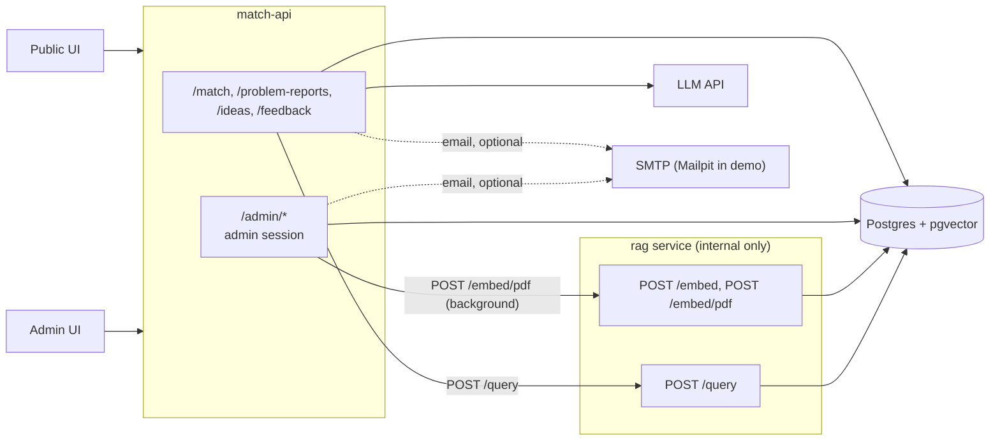
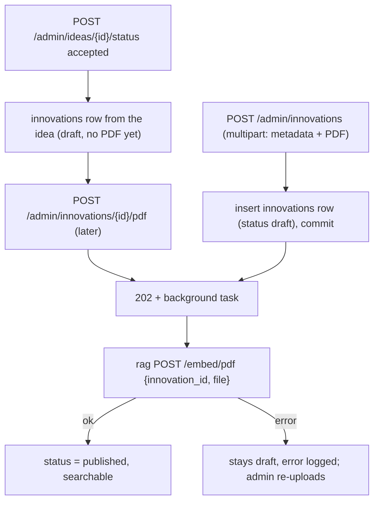
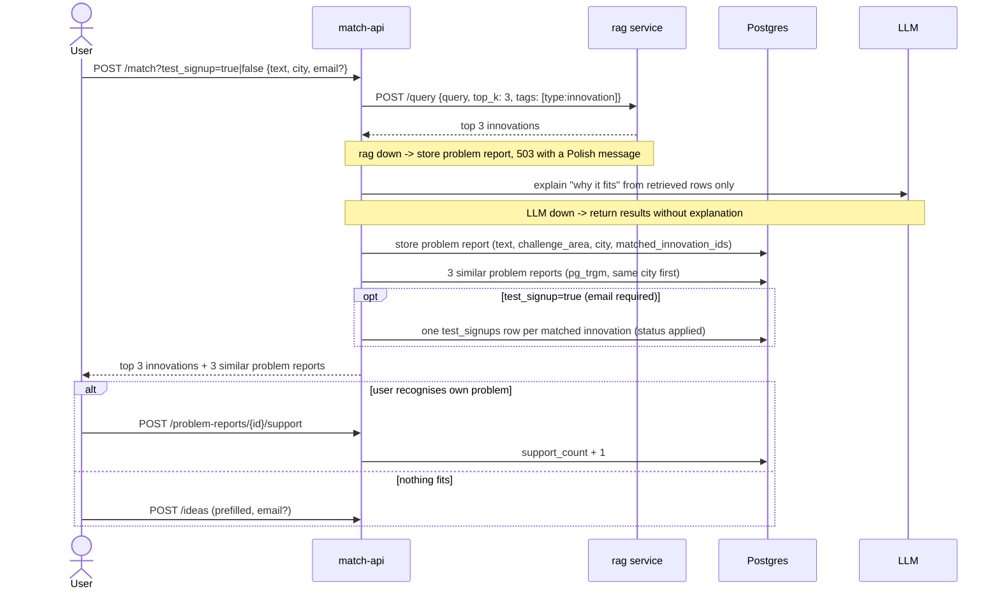
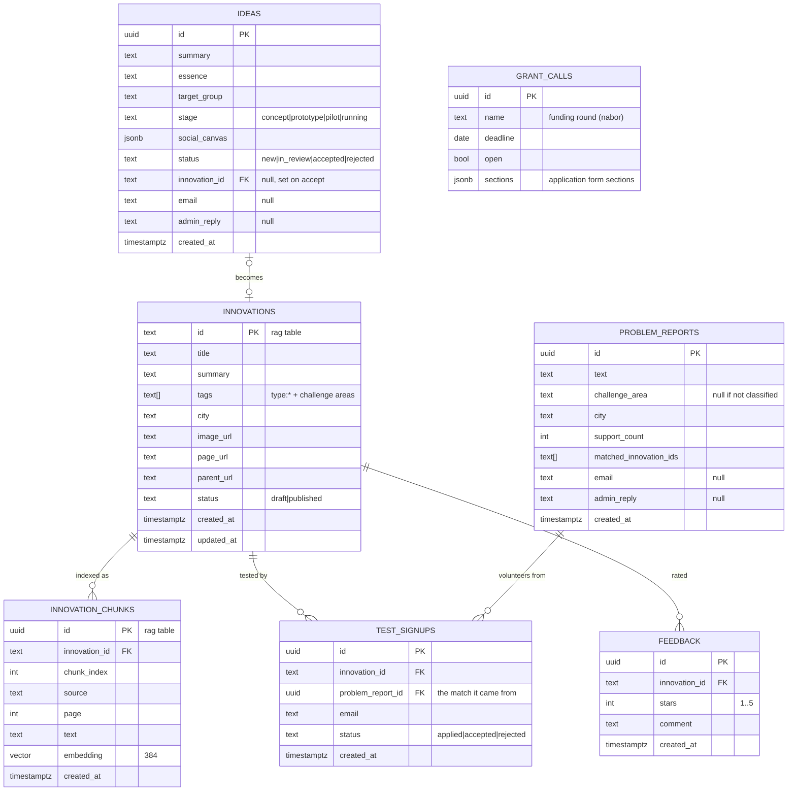

# Backend architecture: rag service + match-api

## Context

ROPS has ~200 social innovations that nobody can find. Matchmaking (problem text -> innovations) is the mandatory 10% of the score. Two small FastAPI services share one Postgres:
- the rag service (`rag/`): chunking, embedding and retrieval. It is finished and is used as merged.
- match-api (`backend/`): the public API and the admin panel.

Inputs: `documentation/CRITERIA-Wojewodztwo-Malopolskie-HUBMI.md`, `documentation/sample-data/` (8 innovations, 8 test queries), the shared team Notion page (`HackYeah`).

Principle: hackathon scope. Build the smallest thing that covers every requirement ([requirements-traceability.md](requirements-traceability.md)), with as few tables as possible. Anything that can be a SQL query on read is not a job. Deferred ideas are listed in section 8.

## 1. Components



| | rag service (`rag/`) | match-api (`backend/`) |
|---|---|---|
| Purpose | embed one innovation's text (`POST /embed`, `POST /embed/pdf`); retrieval (`POST /query`) | `/match` (calls rag, LLM explanation, optional test signup), problem reports, ideas, admin (incl. PDF upload that triggers embedding) |
| Exposure | internal compose network only (no auth) | public + `/admin/*` |
| Writes | `innovation_chunks` | `innovations` rows (admin CRUD), `problem_reports`, `ideas`, `grant_calls`, `test_signups`, `feedback` |
| Down means | `/match` returns 503 (problem report still stored); uploaded innovations stay draft until re-uploaded | site down |

How rag behaves, and what match-api does about it:
- **`POST /query {query, top_k ≤ 3, city?, title?, tags?}`:**
  - returns the best chunk per innovation, `status = 'published'` only
  - the tags filter is an overlap, so `/match` always sends `tags: ["type:innovation"]`
- **`POST /embed {innovation_id, text, ...}`:**
  - needs an existing `innovations` row and replaces all of its chunks
  - match-api inserts and commits the row first, then calls it
- **`innovations.city` is nullable but returned as `str`:** match-api always writes `city` (`''` when unknown).

RabbitMQ (`rabbitmq` in compose, management UI on :15672) runs next to Postgres for match-api to publish to. The api container gets `RABBITMQ_URL`; match-api has no publisher code yet.

## 2. Flow: adding innovations

An innovation is visible to users only once rag has chunks for it, and a PDF from the admin is always the source.



- **Create from a PDF:** `POST /admin/innovations` takes the metadata (title, summary, tags, city, image_url, page_url) plus the PDF. match-api validates it (PDF, ≤ 10 MB, the same limits as rag), inserts the row as `draft`, commits, returns 202 with the id, and calls rag `/embed/pdf` in a FastAPI background task. On success it sets `status = 'published'`.
- **Idea → innovation:** accepting an idea creates a `draft` innovations row from the idea card and stores it in `ideas.innovation_id`. It stays invisible until the admin uploads its PDF with `POST /admin/innovations/{id}/pdf`, which runs the same background embed.
- **Re-upload** replaces all chunks; editing metadata (`PATCH`) does not re-embed.
- **No job table:** the admin list shows `indexed` (has chunks, `EXISTS` on `innovation_chunks`) next to `status`. A failed embed leaves the row as an unindexed draft.
- **Seed:** the 8 sample innovations have no PDFs, so the seed script calls rag `/embed` with their text.

## 3. Flow: matchmaking and problem reports



Testing is part of matching, not a separate endpoint. With `?test_signup=true` the user volunteers to test the innovations matched for their problem: one `test_signups` row per returned innovation, linked to the problem report so the admin sees why. Without an email the request returns 422.

Ranking comes from rag; the LLM only explains and may cite only retrieved rows. User text is data, never instructions. The challenge area (one of the 8 Mapa areas) comes from a small LLM classification call, falling back to none.

## 4. Auth, contact and notifications

- **No public accounts.** An in-process per-IP rate limit guards public writes and `/match`; nothing about the IP is stored.
- **Optional email:** a problem report or idea may carry an `email` (with consent); `POST /match?test_signup=true` requires one. It is stored on the item itself. There is no contact table and there are no profile pages.
- **Admin replies** are an `admin_reply` column on the problem report or idea.
  - The admin sets it; if the item has an email, a notification email is sent.
  - A problem report reply is also shown on its public page, so it covers everyone who pressed "mnie też".
- **Notifier:** SMTP from env, a no-op if unset, Mailpit in compose for the demo (synthetic addresses only). It runs as a FastAPI background task after commit, at-most-once: a failure is logged, not retried. The inbox stays the source of truth.

| Event | Recipient |
|---|---|
| new idea, new problem report | admin (`ADMIN_NOTIFY_EMAIL`) |
| `admin_reply` set, idea status changed | the item's `email` |
| test signup accepted / rejected | the signup's `email` |

- **Admin side:** per-admin accounts (argon2id hashes) in env (`ADMIN_ACCOUNTS`), server-side sessions in memory, `HttpOnly; Secure; SameSite=Strict` cookie; see [.claude/designs/admin-auth.md](../../.claude/designs/admin-auth.md).
  - `require_admin` guards `/admin/*`.
  - `POST /admin/auth/login {email, password}`, `POST /admin/auth/logout`, `GET /admin/auth/me`.
  - Sessions: 8 h absolute, 30 min idle; login limited to 5 failures per email per 15 min; a foreign `Origin` on unsafe methods gets 403.

## 5. Admin endpoints (all under `/admin`, behind the admin session except login and logout)

| Feature | Endpoints |
|---|---|
| Auth | `POST /admin/auth/login` (public), `POST /admin/auth/logout`, `GET /admin/auth/me` |
| Innovations | `GET /admin/innovations` (filters `status`, `indexed`, `q`, `limit`, `offset`), `POST /admin/innovations` (multipart metadata + PDF, 202, embeds in the background), `GET /admin/innovations/{id}`, `PATCH /admin/innovations/{id}` (metadata only), `POST .../{id}/pdf` (upload or replace the PDF, 202), `POST .../{id}/publish`, `POST .../{id}/unpublish`, `GET .../{id}/feedback` (rating avg/count, signups) |
| Inbox | `GET /admin/inbox?since=`: new ideas, new problem reports, critical problem reports, new test signups |
| Ideas | `GET /admin/ideas` (filter `status`), `GET /admin/ideas/{id}`, `POST .../{id}/reply`, `POST .../{id}/status` (`accepted` creates a draft innovation, §2) |
| Problem reports | `GET /admin/problem-reports` (filters `challenge_area`, `city`), `GET /admin/problem-reports/{id}`, `POST .../{id}/reply` |
| Testing | `GET /admin/test-signups` (filter `innovation_id`, `status`), `POST /admin/test-signups/{id}/status` |
| Grant calls | `GET /admin/grant-calls`, `POST /admin/grant-calls`, `PATCH /admin/grant-calls/{id}` (open/close, form sections) |
| Reports | `GET /admin/reports/trends`, `/critical`, `/locations`, `/gaps`, each with `?format=json\|csv` |

### Reports are queries, not jobs

| Report | Query |
|---|---|
| trends | problem reports (+ `support_count`) by challenge area / city / week |
| critical | score = problem reports x distinct cities x growth ratio (last 7d vs previous 7d), computed on read |
| locations | per-city counts by challenge area |
| gaps | problem reports with no matched innovation (empty `matched_innovation_ids`) |

CSV export is a streaming response. Cities with fewer than 5 problem reports are shown as "too few to display".

## 6. Data model

Two rag tables, used as merged, plus five flat match-api tables.



- **Innovation fields** are only what rag's table has. Challenge areas go in `tags`, films are linked through `page_url`.
- **Tags:** every row carries `type:innovation` or `type:report` (ROPS reports and Mapa Wyzwań PDFs), so reports never show up in `/match`.
- **Taxonomy:** the 8 Mapa challenge areas (Rodzina i piecza zastepcza, Bezdomnosc, Niepelnosprawnosc, Ubostwo, Integracja cudzoziemcow, Zdrowie, Zdrowie psychiczne, Seniorzy).
- **city** = gmina, picked from a fixed list.
- **Generated content is not stored:** the grant application generator and Middleman return LLM output.

## 7. Failure modes

| Failure | Handling |
|---|---|
| rag service down | `/match` returns 503 with a plain-language Polish message; the problem report is still stored |
| background `/embed/pdf` fails (rag down, bad PDF) | the row stays an unindexed draft, the error is logged; the admin re-uploads the PDF |
| process restarts during a background embed | same as a failure: the row stays draft, the admin re-uploads (no job table) |
| LLM down | results without explanation or challenge area |
| spam on public routes | per-IP rate limit, input length caps |
| prompt injection | user text treated as data, explanations limited to retrieved rows |
| SMTP unset or down | email skipped; the admin still sees the inbox, the reply is on the public page |
| "mnie też" pressed many times | inflated count, accepted (browser remembers the click) |
| Postgres down | everything down; accepted for MVP |

## 8. Deferred (add only when needed)

| Idea | Add when |
|---|---|
| contacts table, profile/reply links, message threads | one reply column is not enough |
| outbox, worker, webhooks to the grant DB | real integration is needed |
| admin accounts and sessions in Postgres | more than one match-api replica |
| test rounds, verified tester reports | ROPS runs real testing rounds |
| stored grant applications | applications are submitted through the platform |
| report snapshots / materialized views | report queries get slow |

## 9. Layout and build order

```
backend/             # match-api
  app/               # api/*.py, api/admin/*.py, schemas/, services/ (interface + mock first, db next), rag client
  sql/               # one schema file for the 5 tables, mounted into initdb after rag's
rag/                 # used as merged
docker-compose.yml   # postgres (pgvector image), rabbitmq, rag, api, mailpit
```

1. Backend schema file + compose (one `DATABASE_URL`, `RAG_URL`, mailpit).
2. Admin innovations on rag's table: PDF upload + background `/embed/pdf` + auto-publish; idea accept creates a draft innovation; seed the 8 samples.
3. `/match` calling rag, LLM explanation; the 8 sample queries pass.
4. Problem reports, support, similar reports; admin problem reports + reply.
5. Ideas + admin ideas, inbox, notifier.
6. Reports (SQL) + CSV.
7. `test_signup` on `/match`, feedback, grant calls + generator, Middleman.

## 10. Verification

- Unit: rag client errors -> 503, `require_admin` (admin / none), rate limit (429 over the limit).
- Regression: the 8 queries in `sample-matchmaking-queries.md` return the expected id in the top 3.
- Integration:
  - `docker compose up`, seed, curl `/match`
  - draft innovations and `type:report` rows are never returned
  - with rag stopped, `/match` returns 503 and the problem report is stored
  - every `/admin/*` route returns 401 without a session (parametrised test)

## 11. Open questions

1. Can we scrape the Biblioteka Innowacji, or do we stay on sample data plus hand-curated entries?
2. The ROPS PDFs (Mapa Wyzwan, Canvas, reports) need downloading by hand into the repo.
3. Things for the rag owner (rag stays as merged):
   - `all-MiniLM-L6-v2` is English-only and the content is Polish
   - the title/tag boost only fires when the whole query is a substring
   - a null `city` makes `/query` fail with 500

## Changes

1. Admin auth: per-admin accounts + server-side session cookie instead of a shared JWT.
2. IP logic removed; an optional email is stored on the item for notifications.
3. The rag service owns chunking, embedding and retrieval; `/match` calls it over HTTP, rag down gives 503 with the problem report kept.
4. Data model cut to the merged rag tables + five flat match-api tables (`problem_reports`, `ideas`, `grant_calls`, `test_signups`, `feedback`):
   - the email and `admin_reply` live on the item
   - "mnie też" is a `support_count`
   - innovations use only rag's columns; created from an admin PDF (or an accepted idea) and published once embedded
   - `location` is renamed to `city`
   - contacts, interests, test rounds, per-item tokens and index jobs are dropped
5. RabbitMQ added to docker compose (`rabbitmq`, `RABBITMQ_URL` passed to the api); no publisher in match-api yet.
