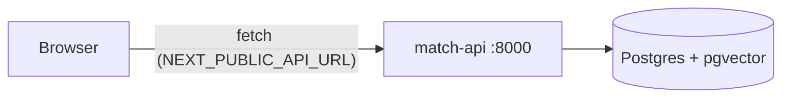

# Frontend architecture: web (Next.js)

## Context

The backend architecture ([../backend/architecture.md](../backend/architecture.md)) names two consumers of `match-api`: a **Public UI** (problem → matched innovations, issues, ideas) and an **Admin UI** (import, inbox, replies, reports). This is one Next.js app serving both, split by route. It is a thin HTTP client — all logic, ranking and auth live in the backend; the frontend only renders and collects input.

Principle (same as backend): build the smallest thing that covers the requirement. No state management library, no component library until a second use justifies it.

## 1. Stack

| Concern | Choice | Why |
|---|---|---|
| Framework | Next.js 15, App Router | file-based routing, server + client components, standalone Docker output |
| Language | TypeScript (strict) | the API types are the contract, mirrored from Pydantic |
| Styling | Tailwind CSS v4 | no config file, utility-first, fast to prototype |
| Data | `fetch` via `lib/api.ts` | one typed client; no extra deps |

## 2. Layout

```
frontend/
  app/
    layout.tsx     # shell: nav, global styles
    page.tsx       # public UI: match form + results
    admin/page.tsx # admin UI skeleton (one route per area later)
    globals.css    # tailwind entry + theme tokens
  lib/api.ts       # typed match-api client (the only place that knows the API)
  Dockerfile       # multi-stage, standalone output
  Makefile         # install / dev / build / lint / up / down
```

As features land, each gets its own route folder (`app/issues/`, `app/ideas/`, `app/admin/reports/`, …) so devs rarely edit the same file — same rule as the backend.

## 3. Talking to the API

- Base URL comes from `NEXT_PUBLIC_API_URL` (default `http://localhost:8000`).
- It is a `NEXT_PUBLIC_*` var, so it is **inlined into the browser bundle at build time**. In Docker it is a build arg, not a runtime env var (see `docker-compose.yml` → `web.build.args`).
- Browser → `match-api` is a cross-origin call; the backend already allows `http://localhost:3000` (`CORS_ORIGINS`).
- Every call handles loading and error states; the UI never assumes the backend is up (see `app/page.tsx`, which degrades gracefully when `/match` is missing).



## 4. Environments

| Mode | Command | API it points at | Notes |
|---|---|---|---|
| Local dev | `make dev` (in `frontend/`) | `http://localhost:8000` | hot reload on :3000; run the backend with `make up` or `make run` |
| Full stack | `docker compose up --build` (repo root) | `http://localhost:8000` | db + api + web together |
| Frontend only in Docker | `docker compose up --build web` | per build arg | still needs `api` reachable from the browser |

See the repo [README](../../README.md) for the full run guide.

## 5. Deferred (add only when needed)

| Idea | Add when |
|---|---|
| Admin auth (store JWT, protect `/admin/*`) | backend admin endpoints exist |
| Shared UI components / design system | a pattern repeats a second time |
| Data fetching lib (TanStack Query) | manual fetch/loading state becomes noise |
| i18n | an English version is required |
| E2E tests (Playwright) | flows stabilise |
