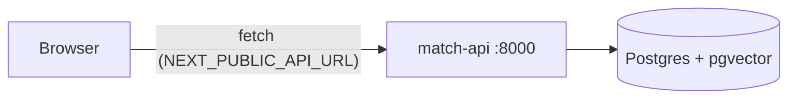

# Frontend architecture: web (Next.js)

## Context

The backend architecture ([../backend/architecture.md](../backend/architecture.md)) names two consumers of `match-api`: a **Public UI** (problem → matched innovations, issues, ideas) and an **Admin UI** (innovations with their stats, inbox, replies, reports). This is one Next.js app serving both, split by route. It is a thin HTTP client — all logic, ranking and auth live in the backend; the frontend only renders and collects input.

Principle (same as backend): build the smallest thing that covers the requirement. No state management library, no component library until a second use justifies it.

## 1. Stack

| Concern | Choice | Why |
|---|---|---|
| Framework | Next.js 15, App Router | file-based routing, server + client components, standalone Docker output |
| Language | TypeScript (strict) | the API types are the contract, mirrored from Pydantic |
| Styling | Tailwind CSS v4 | no config file, utility-first, fast to prototype |
| Data | `fetch` via `lib/api.ts` | one typed client; no extra deps |

## 2. Layout

```
frontend/
  app/
    layout.tsx                  # shell: TopBar (a11y + header) + compact SiteFooter, fonts
    page.tsx                    # public UI: chat (problem -> matched innovations, similar problems, idea form)
    innowacje/page.tsx          # innovation library
    innowacje/[id]/page.tsx     # innovation detail: description, community threads, pointer to test sign-up
    admin/layout.tsx            # admin shell via AdminGate: "tylko dla ROPS", login form or h1 + tabs + logout
    admin/page.tsx              # /admin: innovation list with stats, filters, publish, CSV
    admin/innowacje/[id]/       # /admin/innowacje/{id}: stats of one innovation
    admin/zgloszenia/           # /admin/zgloszenia: inbox, problem reports, ideas, reports, grant calls
    deklaracja-dostepnosci/     # accessibility statement
    globals.css                 # tailwind entry + design tokens, high-contrast and text-scale modes
    fonts/                      # self-hosted icon font subset (scripts/fetch-icons.sh)
  components/                   # TopBar, A11yToolbar, SiteHeader, SiteFooter, InnovationCard, chat/, innovation/, admin/
  lib/api.ts                    # typed match-api client (the only place that knows the API)
  lib/labels.ts                 # polish labels for backend enums (challenge areas, readiness, cost)
  lib/demo-data.ts              # public fallback, shown only when match-api is unreachable
  lib/admin-mock.ts             # admin fallback, shown only when match-api is unreachable
  Dockerfile                    # multi-stage, standalone output
  Makefile                      # install / dev / build / lint / up / down
```

UI follows the Stitch mockups in [stitch/](stitch/) and the tokens in [DESIGN.md](DESIGN.md).

Shared chrome lives in `TopBar` (A11yToolbar + SiteHeader) and a compact `SiteFooter` (only the "Deklaracja dostępności" link), so chat stays the focus of the first viewport. The header has the logo, the site name and a circular menu button (person icon). The drawer links to `/` and `/innowacje` and lists the planned sections ("Mapa wyzwań Małopolski", "Moje zgłoszenia") under "Wkrótce". The public site has no link to `/admin`; ROPS staff open it by URL. The a11y strip links to the accessibility statement as "Dla osób z niepełnosprawnościami"; the footer repeats "Deklaracja dostępności".

The home page is a regular page, not a full-height chat: hero (greeting, "O nas / Czym jest Hub", three quick-action cards), then the conversation, then the input box (not sticky, so it never covers answers). Quick actions show only before the first message and insert a prompt template into the field. Sending scrolls the question to the top so the answer appears under it. The chat takes text only, with no file attachments.

## Public UI

| Screen | Does | API |
|---|---|---|
| `/` chat (`components/chat/Chat.tsx`) | problem text -> top innovations (cards with "Dlaczego pasuje" when `why` is set; `area:*` tags shown as Polish labels) | `POST /match` |
| `/` chat, "Chcę testować" checkbox (also set by the quick action and by `/?testuj=1`) | email + consent, then the same match also signs the person up to test the matched innovations | `POST /match?test_signup=true` |
| `/` chat, similar problems (`SimilarReports.tsx`) | the `similar_reports` of the match, each with "Mnie też" | `POST /problem-reports/{id}/support` |
| `/` chat, "Zgłoś pomysł" / "Mam pomysł" (`IdeaForm.tsx`) | summary, essence, target group, stage, optional email + consent | `POST /ideas` |
| `/innowacje` (`LibraryList.tsx`) | published innovations, 24 per page with "Pokaż więcej" | `GET /innovations?limit=&offset=` |
| `/innowacje/{id}` (`InnovationDetail.tsx`) | description, target group, stage, cost, rating, film; 404 (unknown or draft) shows "Nie znaleziono innowacji" | `GET /innovations/{id}` |
| `/innowacje/{id}` community (`Community.tsx`) | published threads with published replies; new threads and replies go to ROPS moderation (202, not shown until published) | `GET /innovations/{id}/threads`, `POST /innovations/{id}/threads`, `POST /threads/{id}/replies` |

Testing has no per-innovation sign-up in the backend ([.claude/designs/innovation-testing.md](../../.claude/designs/innovation-testing.md)), so the detail page's "Zgłoś się do testowania" box links to `/?testuj=1`. Likes, notifications and the thread "pomocne" counter have no endpoint, so the detail page does not show them; its action bar has only "Zgłoś się do testowania" and "Skopiuj link do tej strony". Optional emails are sent with `consent: true` only after the person ticks the consent checkbox shown next to the email field.

## Admin panel (`/admin`)

The admin's main question is "how is each innovation doing", so `/admin` opens on the innovation list, not the inbox.

| Route | Shows | API |
|---|---|---|
| `/admin` | summary tiles (published, matches in 7 days with trend, people reached, testers waiting, average rating); one card per innovation with matches, 7-day trend, people reached, cities, testers, rating, "needs attention" hints; filters (search, status, challenge area, sort); publish/unpublish; CSV | `GET /admin/innovations`, `GET /admin/reports/innovations` (+ `?format=csv`), `POST .../{id}/publish\|unpublish` |
| `/admin/innowacje/{id}` | description (target group, stage, cost, film), key numbers, matches per week (columns + table view), matched challenge areas and cities (cities under 5 hidden), testers by status, star distribution, comments, latest matched problems | `GET /admin/innovations/{id}`, `GET /admin/innovations/{id}/stats` |
| `/admin/zgloszenia` | inbox tiles, problem reports + reply, ideas + status + reply, reports with CSV, grant calls | `/admin/problem-reports`, `/admin/ideas`, `/admin/reports/*`, `/admin/grant-calls` |
| every `/admin` route (`components/admin/AdminGate.tsx`) | 200 shows the panel and "Zalogowano jako …" with "Wyloguj"; 401 shows the login form; the demo principal (`ADMIN_AUTH_DISABLED=true`) shows "Logowanie wyłączone na czas demonstracji" | `GET /admin/auth/me`, `POST /admin/auth/login`, `POST /admin/auth/logout` |

Charts are single-series in the `primary` token (remapped in high contrast), every bar carries its value as text, and the weekly chart has a table view. Metric definitions: [.claude/designs/admin-innovation-stats.md](../../.claude/designs/admin-innovation-stats.md).

As features land, each gets its own route folder (`app/issues/`, `app/ideas/`, `app/admin/reports/`, …) so devs rarely edit the same file — same rule as the backend.

## 3. Talking to the API

- Base URL comes from `NEXT_PUBLIC_API_URL` (default `http://localhost:8000`).
- It is a `NEXT_PUBLIC_*` var, so it is **inlined into the browser bundle at build time**. In Docker it is a build arg, not a runtime env var (see `docker-compose.yml` → `web.build.args`).
- Browser → `match-api` is a cross-origin call; the backend already allows `http://localhost:3000` (`CORS_ORIGINS`).
- Every call handles loading and error states; the UI never assumes the backend is up.
- All calls run in the browser (library and detail pages are client components too), because the server side of the `web` container cannot reach `localhost:8000`.
- Every call sends `credentials: "include"` (the backend allows credentials for its explicit `CORS_ORIGINS`). Bodiless GETs send no `Content-Type`, so they skip the CORS preflight.



## 4. Environments

| Mode | Command | API it points at | Notes |
|---|---|---|---|
| Local dev | `make dev` (in `frontend/`) | `http://localhost:8000` | hot reload on :3000; run the backend with `make up` or `make run` |
| Full stack | `docker compose up --build` (repo root) | `http://localhost:8000` | db + api + web together |
| Frontend only in Docker | `docker compose up --build web` | per build arg | still needs `api` reachable from the browser |

See the repo [README](../../README.md) for the full run guide.

## 5. Deferred (add only when needed)

| Idea | Add when |
|---|---|
| Data fetching lib (TanStack Query) | manual fetch/loading state becomes noise |
| i18n | an English version is required |
| E2E tests (Playwright) | flows stabilise |

## 6. Accessibility (WCAG 2.1 AA, 20% of the score)

- Toolbar on every page: skip link, "Dla osób z niepełnosprawnościami" (accessibility statement), text size A / A+ / A++ (scales the root font, all sizes are rem), high contrast (black / yellow / white, remaps the colour tokens), read aloud (Web Speech API, reads the selection or `main`). Preferences persist in `localStorage` and apply before hydration. Compact site footer also links to the statement.
- Atkinson Hyperlegible Next, body 18 px, nothing under 14 px; targets at least 48 px.
- Dual focus ring (amber outline + navy halo) on `:focus-visible`; form fields have a 4.6:1 border (DESIGN.md's `#CBD5E1` fails 1.4.11, so we use `outline`).
- Landmarks and headings on every page, labelled forms, `role="status"` for feedback, `role="log"` for the chat, native `<dialog>` for the menu (focus trap, Esc).
- `prefers-reduced-motion` respected. Icons are always `aria-hidden`.
- Checked with axe-core (tags wcag2a/aa, wcag21a/aa) on every page, desktop and 390 px, normal and high contrast: 0 violations. Manual screen reader pass still to do.

### When the API is down

- The real API is always tried first. Only a network error or a 5xx (or 404 on `/match`) switches a public screen to `lib/demo-data.ts`, with a visible "Tryb demonstracyjny" note: the chat answers with `demoMatch` (and says a test sign-up was not saved), the library shows the demo list, the detail page shows the demo entry if its id exists there. Writes (threads, replies, "mnie też", ideas) are never faked: they show an error and can be retried.
- A 4xx from `/match` (422 validation, 429) gives the text back with a message instead of a demo answer.
- Admin: `GET /admin/auth/me` decides between panel and login form. If the API is unreachable the panel renders anyway and each screen switches to `lib/admin-mock.ts` and says so (`components/admin/useApiOrMock.ts`); a 401 mid-session says the session expired. A 404 on `/admin/innowacje/{id}` is shown as "not found", not as an outage.
- Docker compose sets `DEBUG=true` and `ADMIN_AUTH_DISABLED=true`, so the demo panel opens without the login form.
