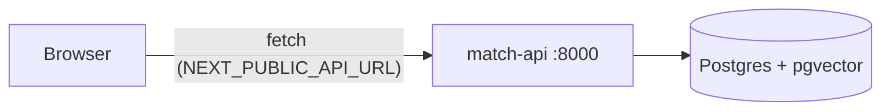

# Frontend architecture: web (Next.js)

## Context

The backend architecture ([../backend/architecture.md](../backend/architecture.md)) names two consumers of `match-api`: a **Public UI** (problem → matched innovations, issues, ideas) and an **Admin UI** (import, inbox, replies, reports). This is one Next.js app serving both, split by route. It is a thin HTTP client — all logic, ranking and auth live in the backend; the frontend only renders and collects input.

Principle (same as backend): build the smallest thing that covers the requirement. No state management library, no component library until a second use justifies it.

## 1. Stack

| Concern | Choice | Why |
|---|---|---|
| Framework | Next.js 15, App Router | file-based routing, server + client components, standalone Docker output |
| Language | TypeScript (strict) | the API types are the contract, mirrored from Pydantic |
| Styling | Tailwind CSS v4 | no config file, utility-first, fast to prototype |
| Data | `fetch` via `lib/api.ts` | one typed client; no extra deps |

## 2. Layout

```
frontend/
  app/
    layout.tsx                  # shell: a11y toolbar, header + menu, footer, fonts
    page.tsx                    # public UI: chat (problem -> matched innovations)
    innowacje/page.tsx          # innovation library
    innowacje/[id]/page.tsx     # innovation detail: description, community threads, test sign-up
    admin/page.tsx              # admin panel, only by url (login off for the demo, see §6)
    deklaracja-dostepnosci/     # accessibility statement
    globals.css                 # tailwind entry + design tokens, high-contrast and text-scale modes
    fonts/                      # self-hosted icon font subset (scripts/fetch-icons.sh)
  components/                   # A11yToolbar, SiteHeader, SiteFooter, InnovationCard, chat/, innovation/, admin/
  lib/api.ts                    # typed match-api client (the only place that knows the API)
  lib/demo-data.ts              # demo innovations until /match and public innovation endpoints exist
  lib/admin-mock.ts             # offline copy of the backend admin mocks
  Dockerfile                    # multi-stage, standalone output
  Makefile                      # install / dev / build / lint / up / down
```

UI follows the Stitch mockups in [stitch/v2/](stitch/v2/) (chat, innovation detail) and the "Małopolska Public Trust" tokens in [DESIGN.md](DESIGN.md). The home page opens with the mockup's example exchange (marked as an example); the first real question replaces it.

As features land, each gets its own route folder (`app/issues/`, `app/ideas/`, `app/admin/reports/`, …) so devs rarely edit the same file — same rule as the backend.

## 3. Talking to the API

- Base URL comes from `NEXT_PUBLIC_API_URL` (default `http://localhost:8000`).
- It is a `NEXT_PUBLIC_*` var, so it is **inlined into the browser bundle at build time**. In Docker it is a build arg, not a runtime env var (see `docker-compose.yml` → `web.build.args`).
- Browser → `match-api` is a cross-origin call; the backend already allows `http://localhost:3000` (`CORS_ORIGINS`).
- Every call handles loading and error states; the UI never assumes the backend is up (see `app/page.tsx`, which degrades gracefully when `/match` is missing).



## 4. Environments

| Mode | Command | API it points at | Notes |
|---|---|---|---|
| Local dev | `make dev` (in `frontend/`) | `http://localhost:8000` | hot reload on :3000; run the backend with `make up` or `make run` |
| Full stack | `docker compose up --build` (repo root) | `http://localhost:8000` | db + api + web together |
| Frontend only in Docker | `docker compose up --build web` | per build arg | still needs `api` reachable from the browser |

See the repo [README](../../README.md) for the full run guide.

## 5. Deferred (add only when needed)

| Idea | Add when |
|---|---|
| Admin login screen (`POST /admin/auth/login`, session cookie) | after the demo; panel already sends the cookie |
| Data fetching lib (TanStack Query) | manual fetch/loading state becomes noise |
| i18n | an English version is required |
| E2E tests (Playwright) | flows stabilise |

## 6. Accessibility (WCAG 2.1 AA, 20% of the score)

- Toolbar on every page: skip link, link to the accessibility statement, text size (one A+ button cycling 100 / 115 / 130 %, all sizes are rem), high contrast (black / yellow / white, remaps the colour tokens), read aloud (Web Speech API, reads the selection or `main`), search (library). Preferences persist in `localStorage` and apply before hydration.
- Public Sans, body 16 px; 12 px only for tags and metadata. Targets at least 44 px.
- Focus ring from DESIGN.md: 3 px `#0b62a4` with a white 2 px gap, on `:focus-visible`. Form fields use `#64748b` borders (4.8:1); DESIGN.md's `#e2e8f0` fails 1.4.11, so it stays on decorative card edges only.
- Landmarks and headings on every page, labelled forms, `role="status"` for feedback, `role="log"` for the chat, native `<dialog>` for the menu (focus trap, Esc).
- `prefers-reduced-motion` respected. Icons are always `aria-hidden`; the icon font and Public Sans are self-hosted (no Google request at runtime).
- The admin panel is not linked from public pages; it is reachable at `/admin` only.
- Checked with axe-core (tags wcag2a/aa, wcag21a/aa) on every page, desktop and 390 px, normal and high contrast: 0 violations. Manual screen reader pass still to do.

### Demo integration

- Chat calls `POST /match`; until it exists the 404 falls back to `demoMatch` over `lib/demo-data.ts` with a visible "Tryb demonstracyjny" note.
- Admin panel calls the real `/admin/*` endpoints (backed by the backend's mock services) with `credentials: "include"`. The backend skips the login when `DEBUG=true` and `ADMIN_AUTH_DISABLED=true` (compose sets both for the demo). If the API is down or answers 401, the panel switches to `lib/admin-mock.ts` and says so.
