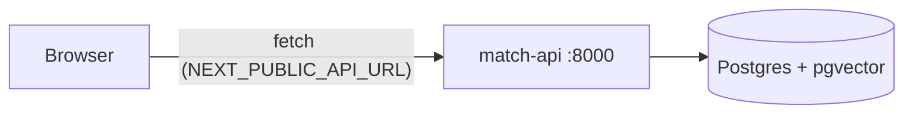

# Frontend architecture: web (Next.js)

## Context

The backend architecture ([../backend/architecture.md](../backend/architecture.md)) names two consumers of `match-api`: a **Public UI** (problem → matched innovations, issues, ideas) and an **Admin UI** (innovations with their stats, inbox, replies, reports). This is one Next.js app serving both, split by route. It is a thin HTTP client — all logic, ranking and auth live in the backend; the frontend only renders and collects input.

Principle (same as backend): build the smallest thing that covers the requirement. No state management library, no component library until a second use justifies it.

## 1. Stack

| Concern | Choice | Why |
|---|---|---|
| Framework | Next.js 15, App Router | file-based routing, server + client components, standalone Docker output |
| Language | TypeScript (strict) | the API types are the contract, mirrored from Pydantic |
| Styling | Tailwind CSS v4 | no config file, utility-first, fast to prototype |
| Data | `fetch` via `lib/api.ts` | one typed client; no extra deps |

## 2. Layout

```
frontend/
  app/
    layout.tsx                  # shell: a11y toolbar, header + menu, footer, fonts
    page.tsx                    # public UI: chat (problem -> matched innovations)
    innowacje/page.tsx          # innovation library
    innowacje/[id]/page.tsx     # innovation detail: description, community threads, test sign-up
    admin/layout.tsx            # admin shell: "tylko dla ROPS", h1, tabs (login off for the demo, see §6)
    admin/page.tsx              # /admin: innovation list with stats, filters, publish, CSV
    admin/innowacje/[id]/       # /admin/innowacje/{id}: stats of one innovation
    admin/zgloszenia/           # /admin/zgloszenia: inbox, problem reports, ideas, reports, grant calls
    deklaracja-dostepnosci/     # accessibility statement
    globals.css                 # tailwind entry + design tokens, high-contrast and text-scale modes
    fonts/                      # self-hosted icon font subset (scripts/fetch-icons.sh)
  components/                   # A11yToolbar, SiteHeader, SiteFooter, InnovationCard, chat/, innovation/, admin/
  lib/api.ts                    # typed match-api client (the only place that knows the API); types follow documentation/api/openapi.json
  lib/demo-data.ts              # demo innovations until /match and public innovation endpoints exist
  lib/admin-mock.ts             # offline copy of the backend admin mocks (incl. innovation stats)
  Dockerfile                    # multi-stage, standalone output
  Makefile                      # install / dev / build / lint / up / down
```

UI follows the Stitch mockups in [stitch/](stitch/) and the tokens in [DESIGN.md](DESIGN.md). Community threads on the innovation detail page (`components/innovation/Community.tsx`) are backed by match-api `threads` / `thread_replies` (see [backend architecture §6](../backend/architecture.md) and [.claude/designs/community-threads.md](../../.claude/designs/community-threads.md)); until those endpoints exist, the component keeps local demo state.

## Admin panel (`/admin`)

The admin's main question is "how is each innovation doing", so `/admin` opens on the innovation list, not the inbox.

| Route | Shows | API |
|---|---|---|
| `/admin` | summary tiles (published, matches in 7 days with trend, people reached, testers waiting, average rating); one card per innovation with matches, 7-day trend, people reached, cities, testers, rating, "needs attention" hints; filters (search, status, challenge area, sort); publish/unpublish; CSV | `GET /admin/innovations`, `GET /admin/reports/innovations` (+ `?format=csv`), `POST .../{id}/publish\|unpublish` |
| `/admin/innowacje/{id}` | description (target group, stage, cost, film), key numbers, matches per week (columns + table view), matched challenge areas and cities (cities under 5 hidden), testers by status, star distribution, comments, latest matched problems | `GET /admin/innovations/{id}`, `GET /admin/innovations/{id}/stats` |
| `/admin/zgloszenia` | inbox tiles, problem reports + reply, ideas + status + reply, reports with CSV, grant calls | `/admin/problem-reports`, `/admin/ideas`, `/admin/reports/*`, `/admin/grant-calls` |

Charts are single-series in the `primary` token (remapped in high contrast), every bar carries its value as text, and the weekly chart has a table view. Metric definitions: [.claude/designs/admin-innovation-stats.md](../../.claude/designs/admin-innovation-stats.md).

As features land, each gets its own route folder (`app/issues/`, `app/ideas/`, `app/admin/reports/`, …) so devs rarely edit the same file — same rule as the backend.

## 3. Talking to the API

- Base URL comes from `NEXT_PUBLIC_API_URL` (default `http://localhost:8000`).
- It is a `NEXT_PUBLIC_*` var, so it is **inlined into the browser bundle at build time**. In Docker it is a build arg, not a runtime env var (see `docker-compose.yml` → `web.build.args`).
- Browser → `match-api` is a cross-origin call; the backend already allows `http://localhost:3000` (`CORS_ORIGINS`).
- Every call handles loading and error states; the UI never assumes the backend is up (see `app/page.tsx`, which degrades gracefully when `/match` is missing).



## 4. Environments

| Mode | Command | API it points at | Notes |
|---|---|---|---|
| Local dev | `make dev` (in `frontend/`) | `http://localhost:8000` | hot reload on :3000; run the backend with `make up` or `make run` |
| Full stack | `docker compose up --build` (repo root) | `http://localhost:8000` | db + api + web together |
| Frontend only in Docker | `docker compose up --build web` | per build arg | still needs `api` reachable from the browser |

See the repo [README](../../README.md) for the full run guide.

## 5. Deferred (add only when needed)

| Idea | Add when |
|---|---|
| Admin login screen (`POST /admin/auth/login`, session cookie) | after the demo; panel already sends the cookie |
| Data fetching lib (TanStack Query) | manual fetch/loading state becomes noise |
| i18n | an English version is required |
| E2E tests (Playwright) | flows stabilise |

## 6. Accessibility (WCAG 2.1 AA, 20% of the score)

- Toolbar on every page: skip link, accessibility statement, text size A / A+ / A++ (scales the root font, all sizes are rem), high contrast (black / yellow / white, remaps the colour tokens), read aloud (Web Speech API, reads the selection or `main`). Preferences persist in `localStorage` and apply before hydration.
- Atkinson Hyperlegible Next, body 18 px, nothing under 14 px; targets at least 48 px.
- Dual focus ring (amber outline + navy halo) on `:focus-visible`; form fields have a 4.6:1 border (DESIGN.md's `#CBD5E1` fails 1.4.11, so we use `outline`).
- Landmarks and headings on every page, labelled forms, `role="status"` for feedback, `role="log"` for the chat, native `<dialog>` for the menu (focus trap, Esc).
- `prefers-reduced-motion` respected. Icons are always `aria-hidden`.
- Checked with axe-core (tags wcag2a/aa, wcag21a/aa) on every page, desktop and 390 px, normal and high contrast: 0 violations. Manual screen reader pass still to do.

### Demo integration

- Chat calls `POST /match`; until it exists the 404 falls back to `demoMatch` over `lib/demo-data.ts` with a visible "Tryb demonstracyjny" note.
- Admin panel calls the real `/admin/*` endpoints (backed by the backend's mock services) with `credentials: "include"`. The backend skips the login when `DEBUG=true` and `ADMIN_AUTH_DISABLED=true` (compose sets both for the demo). If the API is down or answers 401, each admin screen switches to `lib/admin-mock.ts` and says so (`components/admin/useApiOrMock.ts`); a 404 on `/admin/innowacje/{id}` is shown as "not found", not as an outage.
